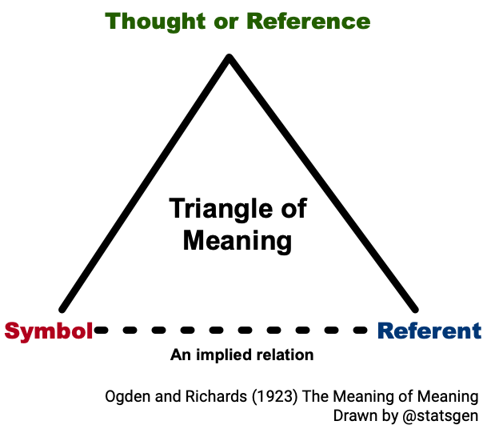
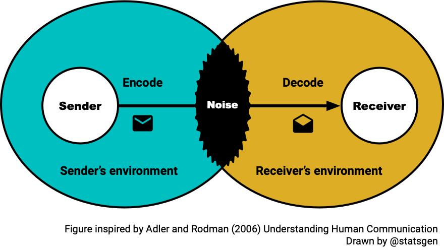
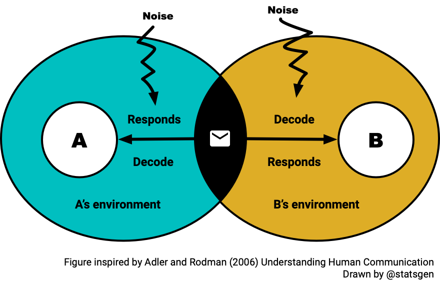
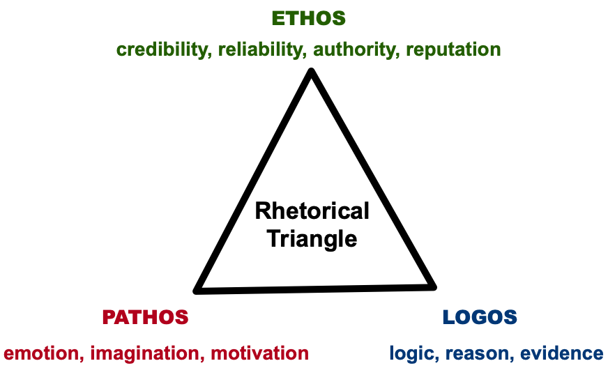
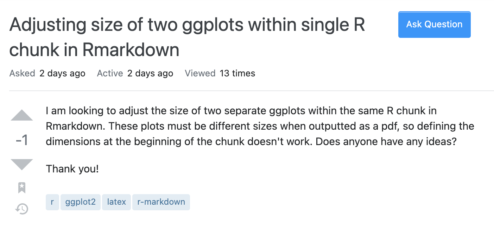
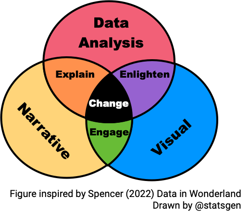

```{r, include = FALSE}
current_file <- knitr::current_input()
basename <- gsub(".[Rq]md$", "", current_file)

knitr::opts_chunk$set(
  #fig.path = sprintf("../images/%s/", basename),
  fig.width = 6,
  fig.height = 4,
  fig.align = "center",
  out.width = "100%",
  fig.retina = 3,
  echo = TRUE,
  warning = FALSE,
  message = FALSE,
  #cache = TRUE,
  cache.path = "cache/"
)
```

## <br>[`r rmarkdown::metadata$pagetitle`]{.monash-blue} {#etc5523-title background-image="images/bg-01.png" background-size="contain"}


### `r rmarkdown::metadata$subtitle`

Lecturer: *`r rmarkdown::metadata$author`*

`r rmarkdown::metadata$department`

::: tl
<br>

<ul class="fa-ul" style="list-style-type: none;">

<li>

<i class="fa-li fas fa-envelope"></i>`r rmarkdown::metadata$email`

</li>

<li>

[<i class="fas fa-calendar-alt"></i>]{.fa-li} `r rmarkdown::metadata$date`

</li>

<li>

[<i class="fas fa-solid fa-globe"></i>]{.fa-li}<a href="`r rmarkdown::metadata[["unit-url"]]`">`r rmarkdown::metadata[["unit-url"]]`</a>

</li>

</ul>

<br>

:::

## 👩🏻‍🏫 ETC5523 Teaching Team

::: {.columns}
::: {.column width='50%'}
<center>

Dr. Michael Lydeamore

*Lecturer & Chief Examiner*
</center>

:::
::: {.column width='50%'}
<center>

Dr. Fonti Kar

*Tutor*
</center>

:::
:::


::: callout-note

## Contacting the teaching team

* For private matters, contact [michael.lydeamore@monash.edu](mailto:michael.lydeamore@monash.edu) using your Monash student email and citing the unit name.
* For non-private matters, you should post this on the Ed discussion board. 

:::


```{css, echo = FALSE}
.circle-img {
  border-radius: 50%;
}
```

## 🎯 ETC5523 Learning Objectives


::: callout-important

## Learning objectives

1. Effectively communicate data analysis, using a blog, reports and presentation.
2. Learn how to build a web app to provide an interactive data analysis.
3. Learn to construct a data story.

:::

::: fragment

::: {.callout-note }

## Specific outcomes

After this unit, you should be able to:

* understand and apply the elements of effective communication,
* **host Quarto HTML outputs online** for blogging, reports or other purposes,
* be more confident with web technologies (**HTML/CSS**),
* make a **Shiny web app**

:::

:::

## 🏛️ ETC5523 unit structure 

* **2 hour lectures** are *interactive sessions*
* **1 hour workshops** → practice skills, ask questions in small groups
* **1 hour tutorial** → only go to the one you are assigned to!

## 🪵 Materials

::: callout-note

## Unit website 

<center>
[[<i class="fas fa-solid fa-link"></i> cwd.numbat.space](https://cwd.numbat.space/)]{.f1}
</center>

:::

* Lecture slides and tutorial materials are available on the unit website
* Lecture videos and assessments will be available on Moodle

::: callout-note

Materials are designed to develop your **hard and soft skills**.

:::


## ✋ Consultation hours

* A total of **2 hours of consultation _each week_** 

* See Moodle announcement for the Zoom links for the consultations
  
* _Seek help early and often_!

## 💯 Course assessments {.smaller}

The assessments build one communication practice in stages:

::: incremental

* **Week 4 — inspect:** identify how published articles, blogs and presentations are structured.
* **Week 7 — translate:** turn academic research into an executive-focused technical report.
* **Week 10 — publish and present:** adapt the report into a blog and recorded data-story briefing.
* **Week 14 — make it reusable and explorable:** package the work, document it and build an interactive app.

:::

. . .

Each assessment is worth **25%**.

## 🏁 Expectations [Part 1]{.f4}

::: incremental

* Attend lectures, workshops and assigned tutorials
* **_Minimum_** total expected workload is 144 hours, that's 12 hours each week or **8.5 hours of self study per week**
* Check the [unit homepage](https://cwd.numbat.space/) and unit Moodle page
* ETC5513 (or equivalent) is a prerequisite → you need to catch up _fast_ if you're not confident
* Install the latest [R](https://cloud.r-project.org/) and [Positron](https://positron.posit.co/) (or your chosen IDE that has the ability to run R code)

:::

## 🏁 Expectations [Part 2]{.f4}


[<i class="fas fa-running"></i> Be an active learner!]{.f1}

::: blockquote 

An **active learner** asks questions, considers alternatives, questions assumptions, and even questions the trustworthiness of the author or speaker. An active learner tries to generalize specific examples, and devise specific examples for generalities.

An active learner doesn’t passively sponge up information — that doesn’t work! — but **uses the readings and lecturer’s argument as a springboard for critical thought and deep understanding**.

[-- Spencer (2022) Data in Wonderland]{.fr}

:::

# Communication time


## {#aim}

::: {.callout-important }

## Aim

* Explain how basic communication theory applies to communicating with data
* Demonstrate communication competence by selecting appropriate behaviour for an audience and monitoring its effect
* Identify and apply rhetorical elements to improve data storytelling 
* Clearly articulate and express technical problems for others to help you

:::

::: {.callout-tip }

## Why

* Analysis is only useful when another person can understand, trust or use it.
* Communication choices are embedded in technical work: tables, plots, reports, documentation and interfaces.
* The course develops one practice across many different forms.

:::

## The model we will use

::: {.center}

[**Audience + purpose**]{.monash-blue}<br>
Who is this for, and what should change?

<i class="fas fa-arrow-down"></i>

[**Claim → evidence → implication**]{.monash-green2}<br>
What should they understand, why should they believe it, and why does it matter?

<i class="fas fa-arrow-down"></i>

[**Form + delivery → feedback + revision**]{.monash-orange2}<br>
How can they use it, and what tells us whether it got through?

:::

::: notes

Preview the model here. We will return to it after communication theory,
rhetoric and the reproducible-example case.

:::


## Communicating


::: {.blockquote}
To effectively communicate, we must realize that we are all different in the way we perceive the world and use this understanding as a guide to our communication with others.

[-- Anthony Robbins]{.fr}

:::

# Communication is a skill

If you practice, it will get better.

## Why should you listen to me though? {.smaller}

I've had a lot of practice.

::: {.fragment}
To scientists:

* Dozens of presentations at conferences and seminars, 
* Broad collaborations in a wide range of fields
:::

::: {.fragment}
To less technical audiences:

* Hundreds of media interviews,
* Probably a hundred ministerial briefings,
* Many more high level meetings with government and industry stakeholders
:::

## What did I just do?

I selected evidence about my experience for a particular audience.

::: incremental

* **Purpose:** establish why this lecture may be worth your attention.
* **Ethos:** build credibility using relevant experience.
* **Selection:** omit experience that does not help that purpose.
* **Risk:** credibility claims still need to be judged critically.

:::

. . .

[Communication is a skill—and this was a communication choice.]{.f1}


## Communicating [with data]{.monash-blue}

::: {.blockquote}
The two words 'information' and 'communication' are often used interchangeably, but they signify quite different things. Information is giving out; **communication is getting through**.

[-- Sydney J. Harris]{.fr}
:::


# The Basics of <br>[Communication Theory]{.monash-blue}

::: callout-warning

## Communication here refers to human communication

In this section, communication refers to **_human_** communication. 
:::


## Communication is [symbolic]{.monash-blue}


::: incremental

- Arbitrary nature of symbols is overcome with linguistic rules
- Agreement among people about these rules is required to effectively communicate
- **Meanings rest in people, not words**

:::

<center>

</center>

## Communication is a [process]{.monash-blue}

Communication is often thought of as discrete, independent acts but in fact it is a continuous, ongoing process.

::: {.columns}
::: {.column width='50%'}
**Linear communication model**

{fig-align="center"}

:::
::: {.column width='50%'}

**Transactional communication**

{fig-align="center"}

:::
:::

## Communication [competence]{.monash-blue}

::: incremental 

* There is **no single ideal way** to communicate: competence is situational and relational.
* Select behaviour appropriate to the **audience, purpose and context**.
* Be able to perform that behaviour, not merely describe it.
* Use **perspective taking** and **cognitive complexity** to see plausible alternatives.
* **Self-monitor** the response and use feedback to adapt.

:::


## [Types]{.monash-blue} of communication

-   **Intrapersonal** [-- communicating with one-self]{.fragment}
-   **Dyadic/interpersonal** [-- two people interacting]{.fragment}
-   **Small group** [-- two or more people interacting with group membership]{.fragment}
-   **Public** [-- a group too large for all to contribute]{.fragment}
-   **Mass** [-- messages transmitted to large, wide-spread audiences via media]{.fragment}

::: fragment

::: callout-note

## Tutorial

How does your communication strategy change for different types of communication?

:::

:::

## [Effective]{.monash-blue} communication 

::: incremental 

* Communication doesn't always require complete understanding 
* We notice some messages more and ignore others, e.g. we tend to notice messages that are:
   * **intense**, 
   * **repetitious**, and 
   * **contrastive**.
* **Motives** also determine what information we select from environment

:::


::: notes 

* We are influenced by what is most obvious

:::


# Rhetoric

The art of effective or persuasive speaking or writing

## Three rhetorical appeals

<center>

</center>

::: notes

Ethos appeals through credibility and trustworthiness.
Pathos appeals through values, stakes and emotion.
Logos appeals through reasoning and evidence.

These appeals can overlap. They are choices within a rhetorical situation, not
fixed labels for the writer, audience and context.

:::

## The rhetorical situation

Before choosing words, visuals or software, ask:

::: {.columns}
::: {.column width="48%"}

* **Speaker/source:** what establishes responsibility and credibility?
* **Audience:** what do they know, value and have power to do?
* **Purpose:** what should change after the communication?

:::
::: {.column width="48%"}

* **Message:** what is the central claim and supporting evidence?
* **Context:** what constraints, conventions and competing messages matter?
* **Form:** what medium makes an appropriate response possible?

:::
:::

## Watch like a communicator

As you watch, identify:

::: incremental

1. the intended audience and purpose;
2. the central claim;
3. the evidence selected to support it;
4. how voice and visuals divide the work; and
5. the response the speaker is trying to create.

:::

## Hans Rosling

<iframe height="80%" width="100%" src="https://www.youtube.com/embed/hVimVzgtD6w?start=148" title="YouTube video player" frameborder="0" allow="accelerometer; autoplay; clipboard-write; encrypted-media; gyroscope; picture-in-picture" allowfullscreen></iframe>

## Debrief the choices

::: incremental

* What could the audience understand from the visual before hearing the explanation?
* What did the speaker add that the visual could not?
* Where did credibility, reasoning and stakes appear?
* What was simplified—and did that simplification preserve the evidence?

:::

. . .

[A compelling form does not replace an honest claim. It helps the claim get through.]{.f1}

## A communication masterclass

<iframe height="80%" width="100%" src="https://www.youtube.com/watch?v=8S0FDjFBj8o" title="YouTube video player" frameborder="0" allow="accelerometer; autoplay; clipboard-write; encrypted-media; gyroscope; picture-in-picture" allowfullscreen></iframe>

## Communicating *your problem*

::: incremental 

* Asking for help, requires you to communicate what your problem is to another party.  

* How you communicate your problem, can assist you greatly in getting the answer to your problem.

:::


## 🆘 Asking for help [1]{.circle .monash-bg-red2 .monash-white} [Part 1]{.f4}

<center>

</center>

Exercise: Come up with a solution to this problem.


## 🆘 Asking for help [1]{.circle .monash-bg-red2 .monash-white} [Part 2]{.f4}


```
I am looking to adjust the size of two separate ggplots within the same R chunk in Rmarkdown. These plots must be different when outputted as a pdf, so defining the dimensions at the beginning of the chunk doesn't work. Does anyone have any ideas? My code is below.
```

````md
`r ''````{r, fig.height = 3, fig.width = 3}
ggplot(df, aes(weight, height)) +
  geom_point()

ggplot(df, aes(height, volume)) +
  geom_point()
```
````

::: notes

* could not find function "ggplot"
* the package needs to be loaded

:::


## 🆘 Asking for help [1]{.circle .monash-bg-red2 .monash-white} [Part 3]{.f4}


```
I am looking to adjust the size of two separate ggplots within the same R chunk in Rmarkdown. These plots must be different when outputted as a pdf, so defining the dimensions at the beginning of the chunk doesn't work. Does anyone have any ideas? My code is below.
```

````md
`r ''````{r, fig.height = 3, fig.width = 3}
library(ggplot2)
ggplot(df, aes(weight, height)) +
  geom_point()

ggplot(df, aes(height, volume)) +
  geom_point()
```
````

::: notes

* Data `df` is not defined!

:::


## 🆘 Asking for help [1]{.circle .monash-bg-red2 .monash-white} [Part 4]{.f4}


```
I am looking to adjust the size of two separate ggplots within the same R chunk in Rmarkdown. These plots must be different when outputted as a pdf, so defining the dimensions at the beginning of the chunk doesn't work. Does anyone have any ideas? My code is below.
```

````md
`r ''````{r, fig.height = 3, fig.width = 3}
library(ggplot2)
df <- read.csv("mydata.csv")
ggplot(df, aes(weight, height)) +
  geom_point()

ggplot(df, aes(height, volume)) +
  geom_point()
```
````

::: notes

* Is the data used in this question necessarily for the question?
* Do we even have a copy of `mydata.csv`??

:::


## 🆘 Asking for help [1]{.circle .monash-bg-red2 .monash-white} [Part 5]{.f4}


```
I am looking to adjust the size of two separate ggplots within the same R chunk in Rmarkdown. These plots must be different when outputted as a pdf, so defining the dimensions at the beginning of the chunk doesn't work. Does anyone have any ideas? My code is below.
```

````md
`r ''````{r, fig.height = 3, fig.width = 3}
library(ggplot2)
ggplot(trees, aes(Girth, Height)) +
  geom_point()

ggplot(trees, aes(Height, Volume)) +
  geom_point()
```
````

::: notes

* Author is using the built-in dataset `trees` here

:::


# ❓ How to ask questions?


## Checklist [(note: not an exhaustive checklist)]{.f4}


<label class="checkbox-container">Is the problem clearly and succinctly described?
<input type="checkbox"><span class="checkmark"></span>
</label>
<label class="checkbox-container">Is the expected solution or behaviour outlined?
<input type="checkbox"><span class="checkmark"></span>
</label>
<label class="checkbox-container">Are you asking the right people at the right place?
<input type="checkbox"><span class="checkmark"></span>
</label>


If the question is **asked in a public forum** or similar:

<label class="checkbox-container">Can people who can answer your question find your question? E.g. does the post have appropriate tags or keywords to reach the right experts?
<input type="checkbox"><span class="checkmark"></span>
</label>
  
  
If the **problem is computer system related**...

<label class="checkbox-container">Can the problem be easily reproduced on other people's system?
<input type="checkbox"><span class="checkmark"></span>
</label>
<label class="checkbox-container">Is the minimum reproducible code or steps supplied?
<input type="checkbox"><span class="checkmark"></span>
</label>

If the **problem is based on data** ...

<label class="checkbox-container">Is the data supplied?
<input type="checkbox"><span class="checkmark"></span>
</label>
<label class="checkbox-container">If the data is big, could you cull your data further to communicate or reproduce the problem?
<input type="checkbox"><span class="checkmark"></span>
</label>


## Session Information 

You can easily get the session information in R using `sessioninfo::session_info()`. <br>[Scroll to see the packages used to make these slides.]{.f4}

::: {.overflow-scroll .h-70}
```{r, include = FALSE}
options(width = 80)
```

```{r}
sessioninfo::session_info()
```
:::


## 🎁 Reproducible Example with `reprex` [LIVE DEMO]{.f4}

* Copy your **minimum reproducible example** then run

```{r, eval = FALSE}
reprex::reprex(session_info = TRUE)
```


* Once you run the above command, your clipboard contains the formatted code and output for you to paste into places like [GitHub issues](https://docs.github.com/en/enterprise/2.15/user/articles/creating-an-issue), [Stack Overflow](https://stackoverflow.com/) and forums powered by [Discourse](https://www.discourse.org/), e.g. [RStudio Community](https://community.rstudio.com/).
* For general code questions, I suggest that you post to the community forums rather than Moodle.

## Communicating with Data


<center>

{fig-align="center"}

</center>

# A map for the course

## Communication is a cycle of choices {.smaller}

::: {.center}

[**Audience + purpose**]{.monash-blue}<br>
Who is it for, and what should change?

<i class="fas fa-arrow-down"></i>

[**Claim → evidence → implication**]{.monash-green2}<br>
What, why believe it, and why does it matter?

<i class="fas fa-arrow-down"></i>

[**Form + delivery**]{.monash-orange2}<br>
What helps people access and use it?

<i class="fas fa-arrow-down"></i>

[**Feedback + revision**]{.monash-fuchsia2}<br>
What got through, and what should change next?

:::

::: notes

This is the spine of the unit. Feedback returns us to the audience, purpose or
any other earlier choice.

:::

## The medium changes; the problem does not

::: {.columns}
::: {.column width="48%"}

**Shape the message**

* presentations and data stories
* articles and reports
* tables and visualisations

:::
::: {.column width="48%"}

**Make the message usable**

* websites and styling
* packages and documentation
* interactive apps and dashboards

:::
:::

. . .

Each output is an **interface between your analysis and an audience**.

## One analysis, many legitimate forms

Suppose your analysis finds that a program improved an outcome, with substantial
uncertainty.

::: incremental

* A **manager** may need the decision, likely benefit and risk.
* An **analyst** may need assumptions, diagnostics and reproducible code.
* The **public** may need context, consequences and plain language.
* **Future you** may need documentation explaining what was done and why.

:::

. . .

[The evidence stays honest; the selection, order and form change.]{.f1}

## Audience-centred does not mean audience-pleasing

::: {.columns}
::: {.column width="48%"}

**Adapt**

* language and level of detail
* order and emphasis
* examples and medium
* the action you make possible

:::
::: {.column width="48%"}

**Do not distort**

* uncertainty or limitations
* relevant context
* scale or comparisons
* what the evidence can support

:::
:::

## Asking for help was not a detour

A reproducible example makes the same communication choices:

::: incremental

* **Audience:** someone who does not share your computer or context
* **Purpose:** enable them to diagnose one problem
* **Message:** expected behaviour versus observed behaviour
* **Evidence:** minimal code, data, output and session information
* **Form and delivery:** a self-contained example in a place they can access

:::

## The question to carry through the course

::: {.center .vcenter}

[What should this audience]{.f1}<br>
[understand, believe or do—]{.f1 .monash-blue}<br>
[and what form will help them get there?]{.f1}

:::

## Week 1 Lesson  {.scrollable}


::: callout-important

## Summary

* Communication is not the transfer of information; it succeeds when a message **gets through** to a particular audience.
* There is no single ideal form. Competence means selecting and performing an appropriate response to the **audience, purpose and context**.
* Across this course, we will move through **audience and purpose → claim, evidence and implication → form and delivery → feedback and revision**.
* Adapting a message must not distort the evidence: the form may change, but the analysis must remain honest.
* A reproducible request for help is our first example of making technical work understandable and usable by someone else.

:::

## Week 1 Lesson

::: callout-tip

## Resources

* See more at [Learn R Chapter 3: Troubleshooting and asking for help](https://learnr.numbat.space/chapter3)
* Watch more about storytelling with data at:
  * [Why storytelling is so powerful in the digital era](https://www.youtube.com/watch?v=mSi0kmqOBu4) 
  * [Why storytelling is more trustworthy than presenting data](https://www.youtube.com/watch?v=Ez5yS4Q5ASA) 
  * [Making data mean more through storytelling](https://www.youtube.com/watch?v=6xsvGYIxJok)

:::
