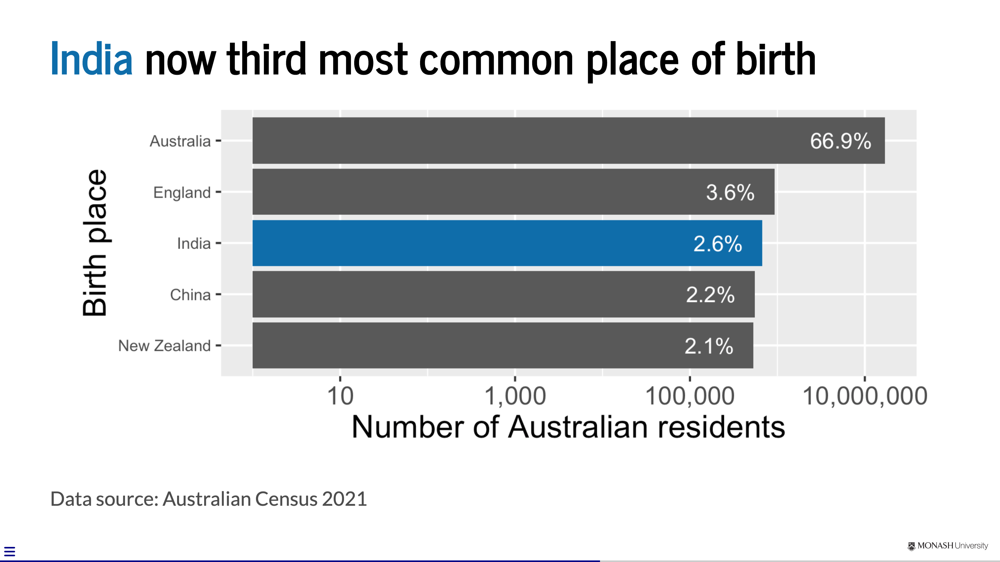
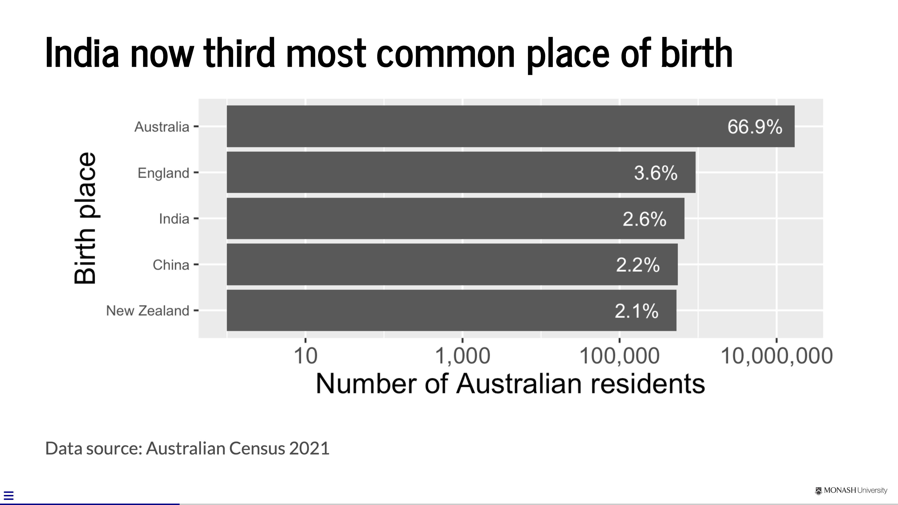
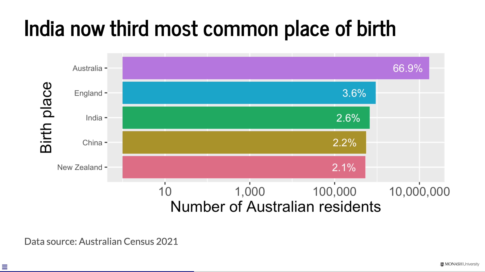
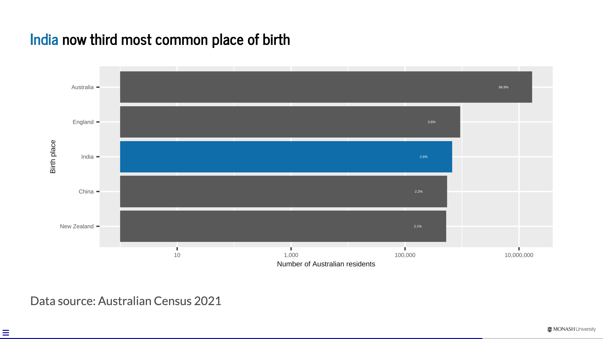
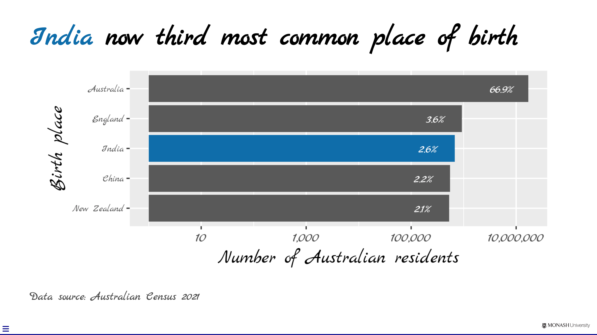

```{r, include = FALSE}
current_file <- knitr::current_input()
basename <- gsub(".[Rq]md$", "", current_file)

knitr::opts_chunk$set(
  #fig.path = sprintf("../images/%s/", basename),
  fig.width = 6,
  fig.height = 4,
  fig.align = "center",
  out.width = "100%",
  fig.retina = 3,
  echo = TRUE,
  warning = FALSE,
  message = FALSE,
  #cache = TRUE,
  cache.path = "cache/"
)
```

## <br>[`r rmarkdown::metadata$pagetitle`]{.monash-blue} {#etc5523-title background-image="images/bg-01.png"}

### `r rmarkdown::metadata$subtitle`

Lecturer: *`r rmarkdown::metadata$author`*

`r rmarkdown::metadata$department`

::: tl
<br>

<ul class="fa-ul">

<li>

[<i class="fas fa-envelope"></i>]{.fa-li}`r rmarkdown::metadata$email`

</li>

<li>

[<i class="fas fa-calendar-alt"></i>]{.fa-li} `r rmarkdown::metadata$date`

</li>

<li>

[<i class="fa-solid fa-globe"></i>]{.fa-li}<a href="`r rmarkdown::metadata[["unit-url"]]`">`r rmarkdown::metadata[["unit-url"]]`</a>

</li>

</ul>

<br>
:::


## {#aim}

::: {.callout-important }

## Aim

::: incremental

* Analyse what an audience knows, cares about, can do and needs next.
* Turn an analytical finding into a **claim, evidence and implication**.
* Compare how reports, journalism, presentations and dashboards organise attention.
* Design and briefly deliver a data story suited to its audience.

:::

:::

. . . 

::: {.callout-tip }

## Why

::: incremental

* The same analysis may become a report, article, briefing, website or app.
* Those formats give the communicator and audience different amounts of control.
* The evidence must remain honest, but its selection, order and explanation must change.

:::
:::

# One finding, many forms

## Our running example

::: {.columns}
::: {.column width="46%"}

### Finding

India is now the third most common country of birth among Australian residents.

### Evidence

The 2021 Census ranks India behind Australia and England, and ahead of China and New Zealand.

:::
::: {.column width="50%"}

### Possible implication

Descriptions of Australia's population that rely on older migration patterns may now misrepresent who lives here.

::: callout-note

The implication is plausible, but it still needs context and must not claim more than the evidence supports.

:::

:::
:::

## Evidence made visible

{fig-align="center" width="82%"}

::: notes

This example will recur throughout the lecture. The chart itself is not raw
analysis: it already contains choices about title, categories, scale, labels and
emphasis.

:::

## Analysis is not yet communication

Before choosing a format, decide:

::: incremental

1. **Audience:** who needs this?
2. **Purpose:** what should change?
3. **Claim:** what should they understand?
4. **Evidence:** why should they believe it?
5. **Implication:** why does it matter?

:::

. . .

[Only then choose the form.]{.f1 .monash-blue}

## A practical audience brief

::: {.columns}
::: {.column width="48%"}

### What do they know?

What context, terminology and uncertainty can be assumed?

### What do they care about?

Which consequences connect the finding to their priorities?

:::
::: {.column width="48%"}

### What can they do?

Can they decide, investigate, share, question or explore?

### What do they need next?

What detail or action makes the communication useful?

:::
:::

## Same evidence, different jobs {.smaller}

| Form | Audience's job | A useful opening |
|---|---|---|
| Technical report | evaluate and decide | conclusion and qualification |
| News story | understand why this matters now | headline and lead |
| Presentation | follow an argument in real time | orienting question or claim |
| Dashboard | investigate a relevant slice | guided overview and controls |

. . .

The “best” structure depends on how the audience will use the communication.

# Structure follows use

## Reports and articles

{fig-align="center"}

The reader can pause, scan, return and inspect detail.

## Journalism

{fig-align="center"}

Lead with what is most important; later detail may never be read.

## Presentations

{fig-align="center"}

Orient the audience, develop the evidence, then land the conclusion.

## Structures are expectations, not laws

::: incremental

* A familiar structure reduces the audience's work.
* Purpose may justify departing from the default.
* Signpost unusual structures so the audience can still follow.
* Do not force the evidence into a dramatic arc it cannot support.

:::

## Who controls the path?

::: {.columns}
::: {.column width="48%"}

### More author-led

* a recorded briefing
* a live presentation
* a news story
* an executive summary

The author selects the order and emphasis.

:::
::: {.column width="48%"}

### More audience-led

* a long technical report
* a website
* an interactive visualisation
* a dashboard

The audience chooses where to pause, branch or explore.

:::
:::

. . .

More control creates more opportunity—and more responsibility for guidance.

# Build the message

## Claim → evidence → implication

::: {.columns}
::: {.column width="31%"}

### Claim

What should the audience understand?

> India is now the third most common country of birth.

:::
::: {.column width="31%"}

### Evidence

Why should they believe it?

> The Census ranks India behind Australia and England.

:::
::: {.column width="31%"}

### Implication

Why does it matter for this audience?

> Older descriptions of the population may need revising.

:::
:::

## The implication must be earned

::: incremental

* An implication connects evidence to a consequence, decision or next question.
* It is not permission to manufacture urgency or certainty.
* State important limitations and alternative explanations.
* Match the strength of the language to the strength of the evidence.

:::

. . .

[“So what?” and “How sure are we?” belong together.]{.f1}

## Create ideas before files

Before opening PowerPoint, Quarto or any other tool:

::: incremental

* write the claim in one sentence;
* identify the evidence that earns it;
* decide the implication for this audience;
* sketch the order on paper; and
* remove material that does not serve that path.

:::

## Where data stories come from

Look for an evidence-supported:

::: {.columns}
::: {.column width="48%"}

* **change** over time;
* **difference** between groups;
* **relationship** between measures;

:::
::: {.column width="48%"}

* **exception** to an expected pattern;
* **consequence** for people or decisions;
* **uncertainty** that changes interpretation.

:::
:::

# Applying cognitive principles

## Keep it simple

. . . 

::: callout-note

## Cognitive Load Theory (John Sweller)

We can only absorb so much information at a time. 

:::

. . . 


<br><br>

Embrace [empty spaces]{.f-headline} in your slides!


## Be audience-centred

::: incremental
* Don't make your audience captives and waste their time away <i class="fa-solid fa-handcuffs"></i>
* Gift your audience knowledge and/or joy <i class="fa-solid fa-face-smile"></i>
:::

. . . 

::: callout-note

## Learning Principles (Richard Mayer)

::: incremental

1. [**Multimedia Principle**]{.monash-blue2}: people learn better from words and pictures than words alone.
2. [**Contiguity Principle**]{.monash-green2}: integrating text and visuals can lead to more learning.
3. [**Coherence Principle**]{.monash-orange2}: superfluous elements irrelevant to the teaching goal can disrupt and interfere with learning.

:::

:::


# Designing the audience's attention

## Slides compete with the speaker

::: incremental

* Your audience cannot carefully read a slide and carefully listen to you at the same time.
* A slide should **support the current idea**, not store everything you know.
* Good design makes the intended order of attention obvious.

:::

. . .

::: callout-important

## Four decisions for every slide

**State the claim → show the evidence → explain the implication → direct attention**

:::

## [1]{.circle .monash-bg-blue .monash-white} State the claim

Compare:

::: {.columns}
::: {.column width="45%"}

### Topic label

> Birthplace

:::
::: {.column width="55%"}

### Takeaway headline

> India is now the third most common country of birth among Australian residents

:::
:::

. . .

A sentence headline tells the audience **what to conclude**. The rest of the
slide must earn that conclusion.

## [2]{.circle .monash-bg-green2 .monash-white} Show the evidence

::: incremental

* Put the evidence on the same slide as the claim it supports.
* Prefer a visual, example or short quotation to a second explanation of the same idea.
* Label evidence directly where possible; do not make the audience hunt between a legend, footnote and graphic.
* Include enough source and context for the claim to be trusted.

:::

. . .

[Visuals are evidence—not decoration.]{.f1}

## [3]{.circle .monash-bg-fuchsia2 .monash-white} Explain the implication

The evidence does not speak for itself.

::: incremental

* Say what changed, who is affected or which decision is now different.
* Keep the implication close to the evidence that supports it.
* Distinguish an observed result from an interpretation or recommendation.
* Make uncertainty visible when it changes what the audience should conclude.

:::

. . .

[Do not make the audience perform the final inference alone.]{.f1}

## [4]{.circle .monash-bg-orange2 .monash-white} Direct attention

Use a small number of signals:

::: {.columns}
::: {.column width="50%"}

* position
* size
* contrast

:::
::: {.column width="50%"}

* spacing
* colour
* sequence

:::
:::

. . .

If everything is emphasised, [nothing is emphasised]{.monash-red2}.

## Colour should explain the reading order

::: flex

{.ba width="30%" .pa3}
{.ba width="30%" .pa3 .fragment}
{.ba width="30%" .pa3 .fragment}

:::

::: incremental

* Neutral colour lets the evidence establish a baseline.
* Many colours create competing categories.
* One contrast colour connects the headline to the evidence.

:::

## Type is infrastructure

::: flex

{.ba width="30%" .pa3}
{.ba width="30%" .pa3 .fragment}
{.ba width="30%" .pa3 .fragment}

:::

::: incremental

* Use type large enough to read from the back of the room.
* Create hierarchy with size and weight before adding another font.
* Choose legibility over personality for body text and labels.

:::

## A final test: remove competition

For every element, ask:

::: incremental

1. Does it help the audience understand the point?
2. Does it provide necessary evidence or context?
3. Does it help them know where to look next?

:::

. . .

If not, remove it. [Empty space is working space for attention.]{.monash-blue}

## Match the treatment to the content {.smaller}

::: {.columns}
::: {.column width="28%"}

### Text

* trim and group
* reveal in sequence
* avoid decorative icons

:::
::: {.column width="28%"}

### Data

* takeaway title
* direct labels
* selective emphasis
* honest scales and uncertainty

:::
::: {.column width="28%"}

### Images

* crop to the relevant detail
* use sufficient resolution
* explain why it is evidence

:::
:::

## Across slides: create continuity

::: incremental

* Reuse layouts so the audience does not have to relearn the slide.
* Give repeated colours and visual forms a stable meaning.
* Use section breaks and signposts to show where the argument is going.
* Let the deck feel coherent, but vary the design when the content needs a different treatment.

:::

# Borrowing from journalism

## A headline makes a promise

A useful headline or slide title is:

::: incremental

* **specific:** it states the subject and the change;
* **concise:** every word helps the audience predict the story;
* **active:** a strong verb shows what happened; and
* **honest:** the body can support the promise without qualification by surprise.

:::

. . .

> **Topic:** Birthplace<br>
> **Claim:** India is now the third most common birthplace among Australian residents

## The lead pays off the promise

::: callout-note

## Headline

India is now the third most common birthplace among Australian residents

:::

. . .

::: callout-important

## Lead

The 2021 Census ranks India behind only Australia and England as a country of birth, and ahead of China and New Zealand.

:::

. . .

The headline gives the claim; the lead supplies evidence and context.

## Concision is selection

Compare:

::: {.columns}
::: {.column width="48%"}

### Before

> The 2021 Census data shows that there are a number of changes that can be observed in relation to the countries in which Australian residents were born.

:::
::: {.column width="48%"}

### After

> India is now the third most common country of birth among Australian residents.

:::
:::

. . .

Week 4 develops the editing techniques. For now: [lead with the claim]{.monash-blue}.

## From telling a story to enabling exploration

::: incremental

1. **Data enriches a story:** selected evidence adds scale or context.
2. **Data reveals a story:** analysis discovers a change, difference or exception.
3. **Data becomes the experience:** an app lets the audience explore within designed constraints.

:::

. . .

The author gives up control of the path, [not responsibility for guidance]{.monash-red2}.

## Activity: one finding, three decisions

Crime Statistics Victoria data are available [here](https://www.crimestatistics.vic.gov.au/crime-statistics/latest-crime-data-by-area).

In pairs:

::: incremental

1. identify one defensible **claim**;
2. name the **evidence** required to support it;
3. write an **implication** for a chosen audience; and
4. decide whether an article, slide or interactive display best serves that audience.

:::


# The three-second test

At first glance, can the audience tell:

::: incremental

* what this slide is about?
* where to look first?
* what the evidence is doing?

:::

. . .

This is a diagnostic, [not a literal time limit]{.monash-red2}.

. . .

[A slide only works in the conditions in which it is delivered.]{.f1}

# From slide to briefing

## Slides and speakers divide the work

::: {.columns}
::: {.column width="48%"}

### The slide

* anchors the claim;
* makes evidence visible;
* directs attention; and
* preserves essential labels and sources.

:::
::: {.column width="48%"}

### The speaker

* supplies context;
* explains the evidence;
* qualifies the interpretation; and
* lands the implication and transition.

:::
:::

. . .

If you read the slide aloud, [one of you is redundant]{.monash-red2}.

## A 60-second data story

::: {.columns}
::: {.column width="30%"}

### 10 seconds

**Orient**

What question or problem are we addressing?

:::
::: {.column width="36%"}

### 35 seconds

**Explain**

What is the claim, and what evidence earns it?

:::
::: {.column width="30%"}

### 15 seconds

**Land**

What is the implication for this audience?

:::
:::

## Practice: make the audience do less work

Using the birthplace example:

::: incremental

1. choose an audience;
2. prepare a 60-second explanation without writing a script;
3. point to the evidence rather than reading labels aloud;
4. finish with an implication; and
5. ask your partner to repeat the takeaway in one sentence.

:::

. . .

Their response is **feedback**: revise what did not get through.

# Deliver to a real audience

## Accessibility is audience-centred design

::: incremental

* Use text large enough for the viewing conditions.
* Maintain strong contrast and never use colour as the only signal.
* Describe the relevant pattern instead of saying “as you can see”.
* Caption recorded speech and provide text alternatives where appropriate.
* Avoid motion, sound or interaction that does not serve the message.

:::

## Live or recorded: protect the message {.smaller}

::: {.columns}
::: {.column width="48%"}

### Check the conditions

* display, aspect ratio and room size
* microphone, sound and lighting
* recording frame and screen legibility
* links, media, animation and live code

:::
::: {.column width="48%"}

### Check the fallback

* local copy of all assets
* PDF or static export
* required adaptor or second device
* captions or transcript
* a plan for explaining a failed demo

:::
:::

. . .

Rehearse the **communication**, not merely whether the file opens.


## Week 2 Lesson


::: callout-important

## Summary

* Begin with what the audience **knows, cares about, can do and needs next**.
* Build the message as **claim → evidence → implication** before choosing a format.
* Reports, journalism, presentations and dashboards structure attention differently because the audience uses them differently.
* In a briefing, the slide makes evidence visible while the speaker supplies context, qualification and implication.
* Accessibility, rehearsal, feedback and fallbacks are part of communication—not technical extras.

:::

## Week 2 Lesson

::: callout-tip

## Resources


Note: the books below are freely available online via Monash Library.

* [Better Presentations: A Guide for Scholars, Researchers, and Wonks by Jonathan Schwabish](https://ebookcentral.proquest.com/lib/monash/detail.action?docID=4723060&pq-origsite=primo)
* [The Craft of Scientific Presentations by Michael Alley](https://link.springer.com/book/10.1007/978-1-4419-8279-7)
* [slide:ology by Nancy Duarte](https://ebookcentral.proquest.com/lib/monash/detail.action?docID=540362)<sup>*</sup>

Note: the book below is not available on Monash library. 

* Presentation zen: simple idea on presentation design and delivery by Garr Reynolds<sup>*</sup>

[<sup>*</sup> These books are oriented toward corporate presentations, so assess their advice in the context of technical communication.]{.f4}

:::

# Appendix: tools and Quarto {visibility="uncounted"}

## Choose a tool that fits the job

* **PowerPoint, Keynote, Canva or Google Slides:** quick visual authoring and collaboration
* **Beamer:** equation-heavy, PDF-first workflows
* **Reveal.js:** browser-based slides with flexible layouts and interaction
* **Quarto + Reveal.js:** reproducible slides combining prose, code, data and output

. . .

Choose the least complicated tool that preserves the communication you need.

## Reveal.js with Quarto

These slides are made with Reveal.js through Quarto.

::: incremental

* The source is Markdown with additional layout and presentation options.
* A first- or second-level heading starts a new slide.
* Code, output and figures can be generated from the same reproducible source.
* HTML output supports links, fragments, embedded media and interactive content.

:::

## A minimal Quarto slide

````markdown
---
title: "My data story"
format: revealjs
---

## The claim goes in the title

The evidence and explanation go here.
````

See the [Quarto Reveal.js documentation](https://quarto.org/docs/presentations/revealjs/) for layouts, themes and presentation options.
