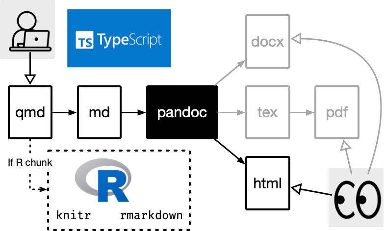
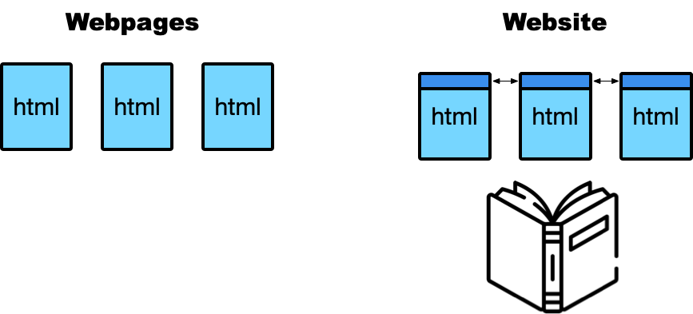
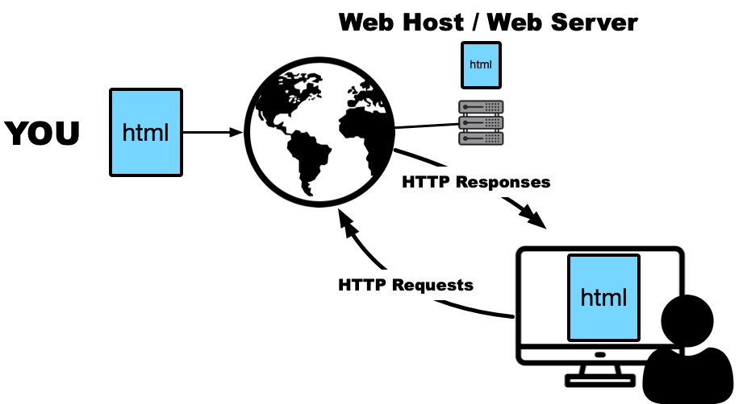

```{r}
#| include: false
library(tidyverse)

birthplace <- readr::read_csv(
  here::here("data", "census-birthplace.csv"),
  show_col_types = FALSE
)

birthplace_2021 <- birthplace |>
  filter(
    census == 2021,
    !birth %in% c("Total", "Not Stated", "Other", "Australia")
  ) |>
  slice_max(count, n = 5) |>
  mutate(birth = forcats::fct_reorder(birth, count))

birthplace_change <- birthplace |>
  filter(
    census %in% c(2016, 2021),
    birth %in% c("India", "China", "New Zealand")
  )
```

## <br>[ETC5523: Communicating with Data]{.monash-blue} {#etc5523-title background-image="images/bg-01.png" background-size="contain"}

### Data storytelling on the web

Lecturer: *Michael Lydeamore*

Department of Econometrics and Business Statistics

::: tl
<br>

<ul class="fa-ul">
<li><span class="fa-li"><i class="fas fa-envelope"></i></span>michael.lydeamore@monash.edu</li>
<li><span class="fa-li"><i class="fas fa-calendar-alt"></i></span>Week 3</li>
<li><span class="fa-li"><i class="fa-solid fa-globe"></i></span><a href="https://cwd.numbat.space">cwd.numbat.space</a></li>
</ul>
:::

## Learning objectives

::: {.callout-important}

By the end of this lecture, you should be able to:

::: incremental

* specify what a standalone web page must tell a reader;
* write a headline and lede whose wording is supported by the evidence;
* select a visual that represents the comparison in the claim;
* distinguish essential context from methods detail and irrelevant material;
* build that structure as a reproducible Quarto website; and
* render, publish and check the result.

:::
:::

## The course framework {.smaller}

::: {.center}

[**Audience + purpose**]{.monash-blue}<br>
Who is it for, and what should change?

<i class="fas fa-arrow-down"></i>

[**Claim → evidence → implication**]{.monash-green2}<br>
What, why believe it, and why does it matter?

<i class="fas fa-arrow-down"></i>

[**Form + delivery**]{.monash-orange2}<br>
What helps people access and use it?

<i class="fas fa-arrow-down"></i>

[**Feedback + revision**]{.monash-fuchsia2}<br>
What got through, and what should change next?

:::

::: notes
[Sources]

- Course framework adapted from `week1/index.qmd`.
:::

## Week 3 applies the framework to a web page

::: {.columns}
::: {.column width="47%"}

### Last week

* audience and purpose
* claim, evidence and implication
* structure across different formats
* directing attention in presentations

:::
::: {.column width="47%"}

### This week

* structure for readers who control the path
* navigation and context
* reproducible web publishing
* feedback from a real reader

:::
:::

. . .

[Next week: improve the sentences, transitions and summaries.]{.f3 .monash-blue}

# How web pages differ from presentations

## The author controls less of the reading sequence

::: {.columns}
::: {.column width="47%"}

### Presentation

The speaker controls:

* order;
* pace;
* emphasis; and
* when context appears.

:::
::: {.column width="47%"}

### Website

The reader can:

* arrive on any page;
* scan or skip;
* follow links;
* pause and return; and
* choose how much detail to inspect.

:::
:::

## A standalone page must supply its own orientation

::: incremental

When a reader arrives directly on a page, they should be able to identify:

* the subject and main result;
* the population, measure and time period;
* the evidence supporting the result;
* the source and any material limitation; and
* the page's place in the wider site.

:::

. . .

[These elements cannot depend on an oral introduction or a previous page.]{.f3 .monash-blue}

## Put the result and its basis in the first screen

::: {.columns}
::: {.column width="47%"}

### First screen

* result-bearing headline
* lede with population, date and magnitude
* first visual or a clear route to it
* source visible with the evidence

:::
::: {.column width="47%"}

### Lower on the page

* fuller interpretation
* caveats
* detailed methods and definitions
* complete tables, code and references

:::
:::

::: notes
[Sources]

- Nielsen Norman Group, “How Users Read on the Web”: https://www.nngroup.com/articles/how-users-read-on-the-web/
:::

## Minimum specification for a short data story {.smaller}

::: incremental

| Element | Question it must answer |
|---|---|
| Population | Who or what is described? |
| Measure | What was counted or calculated, and in what units? |
| Time | When does the evidence apply? |
| Comparison | Relative to what group, place or earlier time? |
| Result | What changed, differed or ranked highest? |
| Source | Where did the data come from? |
| Qualification | What limitation could change the interpretation? |

:::

. . .

Not every item belongs in the headline, but each must be available before it is needed.

## Initial diagnosis: what is missing? {.smaller}

A reader lands directly on a page containing:

> **Australian birthplaces**  
> *The 2021 Census contains information about where Australians were born.*
>
> [A chart with all countries in alphabetical order]

::: incremental

Identify:

1. the result that has not been stated;
2. the denominator and comparison that are ambiguous;
3. the visual change needed to make the result inspectable; and
4. any material that should move below the first screen.

:::

# Specify the claim before building the page

## Running example: country of birth in the Australian Census

The data record the number and percentage of Australian usual residents by reported country of birth.

::: {.columns}
::: {.column width="48%"}

### 2016

* India: **455,389 (1.9%)**
* China: **509,555 (2.2%)**
* New Zealand: **518,466 (2.2%)**

:::
::: {.column width="48%"}

### 2021

* India: **673,352 (2.6%)**
* China: **549,618 (2.2%)**
* New Zealand: **530,492 (2.1%)**

:::
:::

::: notes
[Sources]

- Course data: `data/census-birthplace.csv`, derived from the Australian Bureau of Statistics Census of Population and Housing, 2016 and 2021.
:::

## A 2021 ranking supports a statement about rank

```{r}
#| echo: false
#| fig-width: 9
#| fig-height: 4.2
#| out-width: 88%
#| fig-align: center
ggplot(birthplace_2021, aes(count, birth)) +
  geom_col(fill = "#8a8a8a", width = 0.7) +
  geom_col(
    data = ~ filter(.x, birth == "India"),
    fill = "#006DAE", width = 0.7
  ) +
  geom_text(
    aes(label = scales::percent(percentage / 100, accuracy = 0.1)),
    hjust = 1.1, colour = "white", size = 5
  ) +
  scale_x_continuous(labels = scales::label_comma()) +
  labs(
    x = "Australian usual residents", y = NULL,
    title = "Leading countries of birth outside Australia, 2021",
    caption = "Australia (66.9%) ranked first and is omitted.\nSource: ABS Census of Population and Housing, 2021"
  ) +
  theme_minimal(base_size = 18) +
  theme(panel.grid.major.y = element_blank(), panel.grid.minor = element_blank())
```

[Supported: with Australia first and England second, India ranked third among reported countries of birth in 2021.]{.f3 .monash-blue}

## A one-year visual does not show that a rank changed {.smaller}

From the 2021 chart alone:

::: {.columns}
::: {.column width="48%"}

### Supported

* India **ranked third**.
* India **accounted for 2.6%** of residents.
* India **ranked ahead of** China and New Zealand.

:::
::: {.column width="48%"}

### Not supported

* India **became** third.
* India **overtook** China and New Zealand.
* India's share **increased**.

:::
:::

. . .

The second group requires a baseline or earlier observation.

## Choose the verb from the available comparison {.smaller}

| Evidence available | Verbs normally supported | Verbs not yet supported |
|---|---|---|
| One cross-section | is, ranks, accounts for, differs from | rose, fell, became, overtook |
| Repeated observations | rose, fell, became, overtook | caused, led to |
| Observational association | is associated with, predicts | caused, produced |
| Credible causal design | caused, increased, reduced | universal claims beyond the study scope |

. . .

Check the subject, population, time and comparison as carefully as the verb.

## The change claim requires both censuses

```{r}
#| echo: false
#| fig-width: 9
#| fig-height: 4.2
#| out-width: 90%
#| fig-align: center
ggplot(
  birthplace_change,
  aes(census, percentage / 100, group = birth, colour = birth)
) +
  geom_line(linewidth = 1.4) +
  geom_point(size = 3.8) +
  geom_text(
    data = ~ filter(.x, census == 2016),
    aes(label = paste0(birth, "  ", scales::percent(percentage / 100, accuracy = 0.1))),
    hjust = 1.08, show.legend = FALSE, size = 4.8
  ) +
  geom_text(
    data = ~ filter(.x, census == 2021),
    aes(label = paste0(scales::percent(percentage / 100, accuracy = 0.1), "  ", birth)),
    hjust = -0.08, show.legend = FALSE, size = 4.8
  ) +
  scale_x_continuous(
    breaks = c(2016, 2021),
    expand = expansion(mult = c(0.42, 0.34))
  ) +
  scale_y_continuous(labels = scales::label_percent(accuracy = 0.1)) +
  scale_colour_manual(values = c(
    "India" = "#006DAE", "China" = "#666666", "New Zealand" = "#999999"
  )) +
  coord_cartesian(clip = "off") +
  labs(
    x = "Census year", y = "Percentage of Australian usual residents",
    title = "India moved above China and New Zealand",
    caption = "Source: ABS Census of Population and Housing, 2016 and 2021"
  ) +
  theme_minimal(base_size = 18) +
  theme(
    legend.position = "none", panel.grid.minor = element_blank(),
    panel.grid.major.x = element_blank(), plot.margin = margin(8, 90, 8, 90)
  )
```

## Headline wording must match the visual evidence {.smaller}

::: {.callout-note}

### Topic label: no result

**Country of birth in Australia**

:::

::: {.callout-warning}

### Unsupported if only the 2021 ranking is shown

**India became the third most common country of birth among Australian residents**

:::

::: {.callout-important}

### Supported when the 2016 and 2021 comparison is shown

**India became the third most common country of birth among Australian residents in 2021**

:::

## A headline should specify the result without carrying every detail {.smaller}

Check four components:

| Component | In the worked headline |
|---|---|
| Subject | India |
| Result | became third most common |
| Measure and population | country of birth among Australian residents |
| Time | in 2021 |

. . .

Avoid **“now”** when the publication date is unclear. Use the actual year.

## The lede supplies evidence omitted from the headline

::: {.callout-important}

Of Australian residents counted in the 2021 Census, **673,352 (2.6%)** reported India as their country of birth, up from **455,389 (1.9%)** in 2016. India therefore ranked behind Australia and England but ahead of China and New Zealand.

:::

The lede identifies the population, dates, magnitude, baseline and comparison. It does not repeat the headline in different words.

. . .

**Relevant qualification:** 5.3% of residents did not state a country of birth in 2021; the ranking refers to reported categories.

## Separate the claim, evidence and implication {.smaller}

::: {.columns}
::: {.column width="31%"}

### Claim

India became the third most common reported country of birth in 2021.

:::
::: {.column width="31%"}

### Evidence

India rose from 1.9% in 2016 to 2.6% in 2021, moving above China and New Zealand.

:::
::: {.column width="31%"}

### Implication

Descriptions of Australia's overseas-born population should not assume that the 2016 ordering still applies.

:::
:::

. . .

The implication is an interpretation. It should be proportionate to the evidence, not added merely to make the result sound important.

## Select the visual from the comparison in the claim {.smaller}

| Claim concerns… | Suitable starting point | What the visual must expose |
|---|---|---|
| rank at one time | sorted bar or dot plot | order and magnitude |
| change over time | line or slope plot | common scale and temporal direction |
| difference between groups | dot plot, interval plot or grouped bars | comparable estimates and uncertainty when available |
| distribution | histogram, density, box or interval plot | spread, shape and unusual values |
| geographic pattern | map, often paired with a ranked plot | spatial relationship rather than location alone |
| exact lookup | table | values, units and definitions |

. . .

Colour and annotation direct attention; they cannot repair a visual that encodes the wrong comparison.

## Context belongs in one of three locations {.smaller}

::: {.columns}
::: {.column width="31%"}

### Main path

Needed to interpret the claim correctly.

* population and denominator
* measure and units
* time and comparison
* material limitation
* source

:::
::: {.column width="31%"}

### Methods or appendix

Needed to audit or reproduce the work.

* variable codes
* cleaning decisions
* complete tables
* software and code
* detailed definitions

:::
::: {.column width="31%"}

### Remove

Does not change interpretation or credibility.

* order the analysis was attempted
* software operations with no analytical consequence
* unrelated Census facts
* repetition

:::
:::

## Apply a test before moving or deleting context

For each sentence, ask in order:

::: incremental

1. **Could removing it make the claim ambiguous or misleading?**  
   Keep it on the main path.
2. **Is it needed to audit, reproduce or investigate the result?**  
   Put it in a source note, methods section, appendix or link.
3. **Does it change interpretation, credibility or the reader's next decision?**  
   If not, remove it.

:::

## Worked context edit {.smaller}

### Draft

> The Australian Census is conducted every five years. We downloaded a CSV file, imported it with `readr`, filtered it using `dplyr`, and sorted all countries. India had 673,352 residents in 2021, compared with 455,389 in 2016.

. . .

### Main story

> In the 2021 Census, 673,352 Australian residents (2.6%) reported India as their country of birth, up from 455,389 (1.9%) in 2016.

. . .

**Move to methods:** data extraction, category definitions and cleaning decisions.  
**Remove:** package operations and generic Census background unless they affect the claim.

## Recommended order for this short story

::: incremental

1. **Headline:** state the supported result.
2. **Lede:** supply population, magnitude, date and baseline.
3. **Change visual:** show the comparison required by “became”.
4. **Interpretation:** explain the ordering and its relevance.
5. **Qualification:** define country of birth and disclose material missingness.
6. **Source and methods:** make the result auditable without delaying it.

:::

## Use headings to state section-level findings

::: {.columns}
::: {.column width="47%"}

### Labels only

* Results
* Discussion
* Conclusion

These identify a document part but not its content.

:::
::: {.column width="47%"}

### Findings

* India's share rose between the two censuses
* India moved above China and New Zealand
* The change affects how the ranking is described

These allow a reader to reconstruct the argument while scanning.

:::
:::

## Activity data: Sunday library visits

| Month | Sunday visits |
|---|---:|
| February | 790 |
| March | 1,250 |
| April | 1,540 |
| May | 1,840 |

::: {.callout-note}

These fictional data cover **three council library branches**. Visits are measured using entrance counters; a person who leaves and returns may occasionally be counted twice. Sunday opening began in February.

:::

## Activity: test a headline, lede and visual {.smaller}

Using the library data:

1. choose the comparison your story will make;
2. sketch or describe the first visual;
3. write a headline of at most **12 words**; and
4. write a lede of at most **35 words**.

. . .

Exchange only the headline, lede and visual. Your partner records:

* the population, measure, time and comparison they infer;
* the exact words that the data and visual support;
* any causal or temporal overclaim; and
* whether the counter limitation must accompany the result.

Revise from the recorded interpretation. Do not explain what you intended.

::: notes
[Sources]

- Fictional data created for this teaching activity. The four monthly values sum to the 5,420 visits stated in `week3/workshop/workshop-03.qmd`.
:::

# Implement the structure in Quarto

## Quarto keeps source, computation and output connected

::: {.columns}
::: {.column width="48%"}

{fig-align="center" width="95%"}

:::
::: {.column width="48%"}

::: incremental

* write prose in Markdown;
* generate evidence from code;
* control behaviour with YAML;
* render a complete HTML site; and
* revise the source rather than hand-editing the output.

:::
:::
:::

::: notes
[Sources]

- Course asset: `week3/images/qmd-system.png`.
- Quarto website documentation: https://quarto.org/docs/websites/
:::

## A webpage and a website solve different problems

::: {.columns}
::: {.column width="48%"}

{fig-align="center" width="92%"}

:::
::: {.column width="48%"}

::: incremental

* A **webpage** is one document.
* A **website** connects pages through shared navigation, styling and structure.
* A visitor may encounter the pages in a different order from the one you imagined.

:::
:::
:::

::: notes
[Sources]

- Course asset: `week3/images/webpage-vs-website.png`.
- Quarto website documentation: https://quarto.org/docs/websites/
:::

## Separate site-wide, page and asset files

```text
my-story/
├── _quarto.yml        # site-wide behaviour
├── index.qmd          # home page
├── about.qmd          # another page
├── styles.css         # visual customisation
└── posts/
    └── census-story/
        ├── index.qmd  # story source
        └── chart.png  # story asset
```

. . .

The project structure should help a future collaborator understand what belongs where.

## `_quarto.yml` controls the whole site

```yaml
project:
  type: website

website:
  title: "My data stories"
  navbar:
    right:
      - about.qmd

format:
  html:
    theme: cosmo
    toc: true
```

::: notes
[Sources]

- Quarto website configuration: https://quarto.org/docs/websites/
:::

## A `.qmd` file specifies one page

````markdown
---
title: "India became the third most common country of birth in 2021"
author: "Your name"
date: today
format: html
---

India rose from 1.9% of Australian residents in 2016 to 2.6% in 2021...

## India has moved ahead of China and New Zealand

```{{r}}
# analysis that produces the evidence
```
````

## Preview, render and publish are different checks

::: {.columns}
::: {.column width="31%"}

### Preview

```bash
quarto preview
```

Develop and inspect changes.

:::
::: {.column width="31%"}

### Render

```bash
quarto render
```

Build the complete site.

:::
::: {.column width="31%"}

### Publish

```bash
quarto publish
```

Deliver it to an audience.

:::
:::

::: notes
[Sources]

- Quarto website workflow: https://quarto.org/docs/websites/
:::

## Inspect rendered output before publication

Before publishing, inspect the output—not only the source.

::: incremental

* Does the headline fit on the screen?
* Does the opening make sense without your explanation?
* Are figures, links and cross-references working?
* Can the page be used with keyboard navigation?
* Is essential context visible on a small screen?
* Does every page provide a route onward or back?

:::

## Use descriptive link text

::: {.columns}
::: {.column width="47%"}

### Weak

> For more information, click [here](https://quarto.org/docs/websites/).

The destination is hidden.

:::
::: {.column width="47%"}

### Strong

> Read the [Quarto guide to creating websites](https://quarto.org/docs/websites/).

The reader can predict the destination.

:::
:::

## Cross-references keep evidence connected to claims

````markdown
```{{r}}
#| label: fig-birthplace
#| fig-cap: "India ranks third among countries of birth."
# chart code
```

India now ranks ahead of China and New Zealand
(@fig-birthplace).
````

. . .

A reference should explain why the reader needs the figure—not merely announce that it exists.

## Test paths, navigation and screen width

::: incremental

1. Render from a clean project.
2. Check relative image and page links.
3. Open more than the home page.
4. Test at least one narrow screen.
5. Ask another person to find the main claim.
6. Check the public URL after publishing.

:::

# Render and publish the complete site

## A published site connects four layers

{fig-align="center" width="88%"}

. . .

[Rendering checks the build; publication and reader testing check delivery.]{.f3 .monash-blue}

::: notes
[Sources]

- Course asset: `week3/images/web-pub-system.png`.
:::

## Assignment 3 uses GitHub Pages

Before publishing:

::: incremental

1. Put the Quarto project in a Git repository.
2. Sync the repository with GitHub.
3. Render and inspect the complete site.
4. Publish with the method specified for the assessment repository.
5. Open the public URL and test it as a reader.

:::

. . .

One common route is:

```bash
quarto publish gh-pages
```

::: notes
[Sources]

- Quarto, “GitHub Pages”: https://quarto.org/docs/publishing/github-pages.html
- GitHub, “Configuring a publishing source”: https://docs.github.com/en/pages/getting-started-with-github-pages/configuring-a-publishing-source-for-your-github-pages-site
- Course requirement: `assignments/assignment-3.qmd`.
:::

## Connection to Assignment 3

::: {.columns}
::: {.column width="47%"}

### Communication

* intended audience
* problem and main finding
* page structure
* figure and table integration
* conclusion or implication

:::
::: {.column width="47%"}

### Delivery

* Quarto website
* working navigation
* citations and cross-references
* version-controlled source and output
* public GitHub Pages URL

:::
:::

::: notes
[Sources]

- Course requirements: `assignments/assignment-3.qmd`.
:::

## Workshop and tutorial tasks

::: {.columns}
::: {.column width="47%"}

### Workshop

Shape the story:

* label structural roles;
* compare two possible orders;
* write a headline and lede; and
* test what a reader notices.

:::
::: {.column width="47%"}

### Tutorial

Build and deliver it:

* create the Quarto source;
* place it in a website;
* render the complete project; and
* publish and test the URL.

:::
:::

## Pre-publication review

::: {.center .vcenter}

[Who is the intended reader?]{.f2}<br><br>
[What exact claim does the evidence support?]{.f2 .monash-blue}<br><br>
[Is the necessary context on the main path?]{.f2}<br><br>
[Can a reader verify the claim from the page?]{.f2 .monash-blue}

:::

## Week 3 summary

::: {.callout-important}

### Summary

* Web readers control more of the path, so authors must provide stronger orientation and navigation.
* Shape the **claim, evidence, implication and story order** before choosing a tool.
* Quarto connects source, computation and output in a reproducible website workflow.
* Previewing, rendering, publishing and reader-testing are different stages of delivery.
* The site succeeds when a real reader can understand and use the story.

:::

# If there is time: optional web features

## Netlify can host a rendered static site

::: {.columns}
::: {.column width="52%"}

1. Render the complete site.
2. Identify the output directory.
3. Deploy it through Netlify.
4. Open the public URL and test it.

:::
::: {.column width="42%"}

### One publishing route

```bash
quarto publish netlify
```

Always open the deployed site and test more than the home page.

:::
:::

::: notes
[Sources]

- Quarto website publishing overview: https://quarto.org/docs/websites/
:::

## `webR` can move R computation into the browser

`webR` runs R through WebAssembly inside a web browser.

::: incremental

* readers can execute examples without installing R;
* interactive computation can sit beside explanation; and
* the extra capability also adds loading, testing and accessibility responsibilities.

:::

. . .

[Explore the webR REPL](https://webr.r-wasm.org/latest/)

::: notes
[Sources]

- webR documentation: https://docs.r-wasm.org/webr/latest/
:::

## A Quarto extension can add `webR` cells

```yaml
---
title: "Interactive R example"
format: html
filters:
  - webr
---
```

```bash
quarto add coatless/quarto-webr
```

````markdown
```{{webr-r}}
summary(lm(mpg ~ wt, data = mtcars))
```
````

::: notes
[Sources]

- quarto-webr extension: https://github.com/coatless-quarto/r-wasm
- webR documentation: https://docs.r-wasm.org/webr/latest/
:::

## Mermaid turns text into a diagram

```{mermaid}
%%| echo: false
%%{init: {'themeVariables': {'fontSize': '28px'}}}%%
flowchart LR
  A[Question] --> B[Analysis]
  B --> C[Claim]
  C --> D[Evidence]
  D --> E[Implication]
  E --> F[Reader action]
```

::: notes
[Sources]

- Quarto diagrams documentation: https://quarto.org/docs/authoring/diagrams.html
:::

## The diagram remains reproducible source

````markdown
```{{mermaid}}
flowchart LR
  A[Question] --> B[Analysis]
  B --> C[Claim]
  C --> D[Evidence]
  D --> E[Implication]
  E --> F[Reader action]
```
````

. . .

Use a diagram when relationships are easier to understand spatially than as prose.

## Use an interactive map when location is analytically relevant

```r
library(leaflet)

locations |>
  leaflet() |>
  addTiles() |>
  addMarkers(
    lng = ~lng,
    lat = ~lat,
    popup = ~name
  )
```

::: incremental

Before adding a map, ask:

* What question becomes easier to answer?
* What should the first view emphasise?
* What information appears on demand?

:::

## Optional features still need a communication job

::: {.columns}
::: {.column width="31%"}

### `webR`

Useful when running code changes understanding.

:::
::: {.column width="31%"}

### Mermaid

Useful when relationships need a visible structure.

:::
::: {.column width="31%"}

### Maps

Useful when location is essential to the question.

:::
:::

. . .

[Add an optional feature only when it helps the audience complete a defined task.]{.f3 .monash-blue}

## Resources

* [Quarto: Creating a Website](https://quarto.org/docs/websites/)
* [Quarto: Website Navigation](https://quarto.org/docs/websites/website-navigation)
* [Quarto: GitHub Pages](https://quarto.org/docs/publishing/github-pages.html)
* [Quarto: Cross References](https://quarto.org/docs/authoring/cross-references.html)
* [Quarto: Diagrams](https://quarto.org/docs/authoring/diagrams.html)
* [webR documentation](https://docs.r-wasm.org/webr/latest/)
