```{r, include = FALSE}
#| label: setup
current_file <- knitr::current_input()
basename <- gsub(".[Rq]md$", "", current_file)
library(tidyverse)
library(patchwork)
library(here)
library(kableExtra)
library(scales)
library(colorspace)
library(carData)
# colorblindr is GitHub-only: remotes::install_github("clauswilke/colorblindr")
# plotrix, ggtext, glue used via :: below
df <- read_csv(here::here("data/census-birthplace.csv"))
df2021 <- df %>% 
  filter(census == 2021) %>% 
  filter(!birth %in% c("Total")) %>% 
  select(-census)

workflow_birthplace <- df2021 %>%
  filter(!birth %in% c("Australia", "Other", "Not Stated")) %>%
  slice_max(count, n = 5) %>%
  mutate(birth = fct_reorder(birth, percentage))

df2 <- df %>% 
  filter(census %in% c(2021, 2016)) %>% 
  filter(!birth %in% c("Total")) %>% 
  filter(!birth %in% c("Not Stated", "Other", "Australia")) %>% 
  group_by(census) %>% 
  mutate(rank = rank(-percentage)) %>% 
  filter(rank %in% 1:5) %>% 
  ungroup()

dfsex <- read_csv(here::here("data/census-birthplace-by-sex.csv")) %>% 
  filter(!birth %in% c("Total")) %>% 
  filter(!birth %in% c("Not Stated", "Other", "Australia")) %>% 
  mutate(birth = fct_reorder(birth, count, mean)) %>% 
  group_by(sex) %>% 
  mutate(rank = rank(-percentage)) %>% 
  filter(rank %in% 1:5) %>% 
  ungroup()

vis_spacing <- 'style="padding-left:20px;"'
vis_spacing1 <- 'style="padding-left:10px;"'

knitr::opts_chunk$set(
  fig.path = sprintf("images/%s/", basename),
  fig.width = 6,
  fig.height = 4,
  fig.align = "center",
  out.width = "100%",
  fig.retina = 3,
  warning = FALSE,
  message = FALSE,
  dev = "svg",
  dev.args = list(bg = "transparent")
)
```

## <br>[`r rmarkdown::metadata$pagetitle`]{.monash-blue} {#etc5523-title background-image="images/bg-01.png"}

### `r rmarkdown::metadata$subtitle`

Lecturer: *`r rmarkdown::metadata$author`*

`r rmarkdown::metadata$department`

::: tl
<br>

<ul class="fa-ul">

<li>

[<i class="fas fa-envelope"></i>]{.fa-li}`r rmarkdown::metadata$email`

</li>

<li>

[<i class="fas fa-calendar-alt"></i>]{.fa-li} `r rmarkdown::metadata$date`

</li>

<li>

[<i class="fa-solid fa-globe"></i>]{.fa-li}<a href="`r rmarkdown::metadata[["unit-url"]]`">`r rmarkdown::metadata[["unit-url"]]`</a>

</li>

</ul>

<br>
:::


```{css, echo = FALSE}
.reveal p {
    display: block;
    margin-block-start: 0em;
    margin-block-end: 0em;
    margin-inline-start: 0px;
    margin-inline-end: 0px;
    margin: 0;
}
```


## {#aim}

::: {.callout-important }

## Aim

* Apply data-visualisation principles to communicate a message clearly and efficiently
* Use data visualisation to create effective data stories


:::

. . . 

::: {.callout-tip }

## Why

* "A picture is worth a thousand words."
* Data visualisation can make large, complex data more accessible, understandable and usable.

:::


## Data visualisation

::: blockquote

Data visualization is **part art** and **part science**. The challenge is to get the art right without getting the science wrong and vice versa.

-- Claus O. Wilke, *Fundamentals of Data Visualization*

:::

. . . 

::: callout-note

## Role

* A data visualisation must communicate the data accurately to its intended audience.
* A data visualisation must not mislead or distort the information in the data.

:::

. . . 


## 💬️ Communicating with data visualisation

::: {.callout-note}

## Communication

Effective data visualisation uses the human visual system to help an audience understand a particular message in the data.

:::

. . . 


* In this lecture, the terms data visualisation, plot, graphic, statistical graphic and figure are used interchangeably.


## Place of birth in the 2021 Australian Census {.scrollable auto-animate=true}

```{r}
df2021 %>% 
  mutate(count = scales::comma(count, 1),
         percentage = scales::comma(percentage, 0.1)) %>% 
  knitr::kable(col.names = c("Place of birth", "Count", "%"),
               align = "lrr") %>% 
  kableExtra::kable_classic(full_width = FALSE)
```

## Place of birth in the 2021 Australian Census {auto-animate=true}

```{r census2021-part1, fig.width = 12, fig.height = 4}
df2021 %>% 
  ggplot(aes(birth, percentage)) +
  geom_col() +
  theme(text = element_text(size = 18),
        axis.text.x = element_text(angle = 45, size = 10, hjust = 1)) + 
  labs(x = "", y = "Percentage", caption = "Data source: Australian Census 2021")
```

. . . 

Which country of birth is the third most common among Australian residents?


## Place of birth in the 2021 Australian Census {auto-animate=true}

```{r census2021-part2, fig.width = 12, fig.height = 4}
df2021 %>% 
  mutate(birth = fct_reorder(birth, -percentage)) %>% 
  ggplot(aes(birth, percentage)) +
  geom_col() +
  theme(text = element_text(size = 18),
        axis.text.x = element_text(angle = 45, size = 10, hjust = 1)) + 
  labs(x = "", y = "Percentage", caption = "Data source: Australian Census 2021")
```

. . . 

<i class="fa-solid fa-face-meh" style=" transform: rotate(-45deg)"></i> Can you read the labels without tilting your head?

## Place of birth in the 2021 Australian Census {auto-animate=true .scrollable}

```{r census2021-part4, fig.height = 12, fig.width = 4}
df2021 %>% 
  mutate(birth = fct_reorder(birth, percentage)) %>% 
  ggplot(aes(percentage, birth)) +
  geom_col() +
  theme(text = element_text(size = 18),
        axis.text.y = element_text(size = 8)) + 
  labs(y = "", x = "Percentage", caption = "Data source: Australian Census 2021")
```

. . . 

What's the data story? 

## India became the third most common country of birth in 2021 {.smaller auto-animate=true}

::: flex

::: w-60

```{r census2021-part5}
total2021 <- df %>% 
  filter(birth=="Total" & census==2021) %>% 
  pull(count)
auperc2021 <- df %>% 
  filter(birth=="Australia" & census==2021) %>% 
  pull(percentage)
nsperc2021 <- df %>% 
  filter(birth=="Not Stated" & census==2021) %>% 
  pull(percentage)
df2021 %>% 
  arrange(desc(percentage)) %>% 
  filter(!birth %in% c("Australia", "Other", "Not Stated")) %>% 
  slice(1:5) %>% 
  mutate(birth = fct_reorder(birth, count)) %>% 
  ggplot(aes(count, birth)) +
  geom_col() +
  geom_col(data = ~filter(.x, birth=="India"),
           fill = "#006DAE") + 
  geom_text(aes(label = scales::percent(percentage/100, 0.1)),
            nudge_x = -50000, color = "white") +
  scale_x_continuous(labels = scales::comma) +
  theme(text = element_text(size = 18),
        axis.text.y = element_text(size = 8),
        plot.title.position = "plot") + 
  labs(y = "Place of birth", x = "Number of Australian residents\n", caption = "Data source: Australian Census 2021",
       title = "Five most common countries of birth outside Australia")
```


:::

::: {.w-40 .f3}

<br><br><br>

* Each label gives the percentage of `r scales::comma(total2021)` Australian residents born in that country.

* Place of birth was not stated for `r scales::percent(nsperc2021/100, 0.1)` of Australian residents.

* Australia is the most common country of birth: `r scales::percent(auperc2021/100, 0.1)` of residents were born in Australia.


<i class="fa-solid fa-newspaper"></i> Story from [The Guardian](https://www.theguardian.com/australia-news/2022/jun/28/india-now-third-most-common-place-of-birth-of-australian-residents-census-results-show).

:::


:::


## Another look

::: callout-note

## Data story

India has overtaken China and New Zealand to become the third largest country of birth for Australian residents, 2021 census data has found.

[-- The Guardian](https://www.theguardian.com/australia-news/2022/jun/28/india-now-third-most-common-place-of-birth-of-australian-residents-census-results-show)

:::

::: {.columns}

::: {.column width="50%"}

### 2016

```{r}
df2 %>%
  filter(census == 2016) %>%
  select(-rank, -census) %>%
  mutate(count = scales::comma(count, 1),
         percentage = scales::comma(percentage, 0.1)) %>% 
  knitr::kable(col.names = c("Place of birth", "Count", "%"),
               align = "lrr") %>%
  kableExtra::kable_classic(full_width = FALSE) %>%
  kableExtra::kable_styling(font_size = 18)
```

:::

::: {.column width="50%"}

### 2021

```{r}
df2 %>%
  filter(census == 2021) %>%
  select(-rank, -census) %>%
  mutate(count = scales::comma(count, 1),
         percentage = scales::comma(percentage, 0.1)) %>%
  knitr::kable(col.names = c("Place of birth", "Count", "%"),
               align = "lrr") %>%
  kableExtra::kable_classic(full_width = FALSE) %>%
  kableExtra::kable_styling(font_size = 18)
```

:::

:::

## India overtook China and New Zealand by 2021

```{r census2-part1, fig.width = 8, fig.height = 3}
df2  %>% 
  mutate(birth = fct_reorder(birth, count, sum)) %>% 
  ggplot(aes(count, birth)) +
  geom_col() + 
  geom_col(data = ~filter(.x, birth=="India"),
            fill = "#006DAE") +
  geom_text(aes(label = scales::percent(percentage/100, 0.1)),
            nudge_x = -70000, color = "white") +
  theme(text = element_text(size = 18),
        axis.text.y = element_text(size = 8),
        plot.title.position = "plot") +
  facet_wrap(~census) + 
  scale_x_continuous(labels = scales::comma) +
  labs(y = "Place of birth", x = "Number of Australian residents\n", caption = "Data source: Australian Census 2016 and 2021",
        title = "Five most common countries of birth outside Australia")
```


. . . 

Does this show that India overtook China and New Zealand?


## India overtook China and New Zealand by 2021 {.smaller}

```{r census2-part2, fig.width = 7, fig.height = 2.9}
df2 %>% 
  ggplot(aes(factor(census), count, color = birth)) +
  geom_line(aes(group = birth))  +
  theme(text = element_text(size = 18),
        axis.text.y = element_text(size = 8),
        plot.title.position = "plot") + 
  geom_point() + 
  scale_y_continuous(labels = scales::comma) +
  labs(y = "Number of\nAustralian residents\n", caption = "Data source: Australian Census 2016 and 2021", x = "Census year", color = "Place of birth")
```

. . . 

Should we show percentage instead of counts?


## India overtook China and New Zealand by 2021 {.smaller}

```{r census2-part3, fig.width = 7, fig.height = 2.9}
df2 %>% 
  ggplot(aes(factor(census), percentage/100, color = birth)) +
  geom_line(aes(group = birth)) + 
  geom_point() + 
  theme(text = element_text(size = 18),
        axis.text.y = element_text(size = 8),
        plot.title.position = "plot") + 
  scale_y_continuous(labels = scales::percent) +
  labs(y = "Percentage of\nAustralian residents\n", caption = "Data source: Australian Census 2016 and 2021", x = "Census year", color = "Place of birth")
```


. . . 

The legend and the line order are different...


## India overtook China and New Zealand by 2021 {.smaller}

```{r census2-part4, fig.width = 7, fig.height = 2.9}
df2 %>% 
  arrange(census, birth) %>% 
  mutate(birth = fct_reorder2(birth, census, percentage, last2)) %>% 
  ggplot(aes(factor(census), percentage/100, color = birth)) +
  geom_line(aes(group = birth)) + 
  geom_point() + 
  theme(text = element_text(size = 18),
        axis.text.y = element_text(size = 8),
        plot.title.position = "plot") + 
  scale_y_continuous(labels = scales::percent) +
  labs(y = "Percentage of\nAustralian residents\n", caption = "Data source: Australian Census 2016 and 2021", x = "Census year", color = "Place of birth")
```


. . . 

Maybe we can put the labels directly in the plot?

## India overtook China and New Zealand by 2021 {.smaller}

```{r census2-part5, fig.width = 7, fig.height = 3}
df2 %>% 
  arrange(census, birth) %>% 
  ggplot(aes(factor(census), percentage/100, color = birth)) +
  geom_line(aes(group = birth)) + 
  geom_point() + 
  theme(text = element_text(size = 18),
        axis.text.y = element_text(size = 8),
        plot.title.position = "plot",
        legend.position = "none") + 
  scale_y_continuous(labels = scales::percent) +
  geom_text(aes(label = birth), 
            data = ~{ .x %>% 
                filter(census==2021) %>% 
                mutate(percentage = case_when(birth=="China" ~ percentage + 0.05,
                                              birth=="New Zealand" ~ percentage - 0.05,
                                              TRUE ~ percentage))}, 
            hjust = 0, nudge_x = 0.05) +
  labs(y = "Percentage of\nAustralian residents\n", caption = "Data source: Australian Census 2016 and 2021", x = "Census year", color = "Place of birth")
```


# Choosing a plot

## 🛒 What do you want to show? {.smaller}

Start with the question you want the visualisation to answer.

::: {.columns}

::: {.column width="50%"}

**Compare values**

For example, compare the five most common overseas countries of birth in 2021.

<center>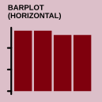</center>

:::

::: {.column width="50%"}

**Show change over time**

For example, show India overtaking China and New Zealand between 2016 and 2021.

<center>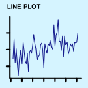</center>

:::

:::

## 🛒 What do you want to show? {.smaller}

::: {.columns}

::: {.column width="50%"}

**Show a distribution**

For example, examine how salaries vary within each academic rank.

<center>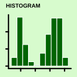</center>

:::

::: {.column width="50%"}

**Show a relationship**

For example, examine the relationship between years since PhD and salary.

<center>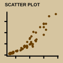</center>

:::

:::

## 🤔 Revisiting the Census example

* The data type, audience and medium also affect the choice of plot.

* The ordered horizontal bar chart makes values and labels easy to compare.

. . .

* The line chart emphasises change between the two Census years.

. . .

* Direct labels remove the need to look back and forth between the lines and a legend.

. . .

* Pie charts would make these comparisons harder because they encode values as angles and areas.


## <i class="fas fa-project-diagram blue"></i> Composite plots {.smaller}

* A plot can combine **multiple geometries** in one panel:

```{r box-plus-violin, fig.height = 3}
ggplot(Salaries, aes(rank, salary)) +
  geom_violin(fill = "grey92", color = "grey40") +
  geom_boxplot(width = 0.12, fill = "white", outlier.alpha = 0.6) +
  scale_y_continuous(labels = scales::comma) +
  labs(x = "Rank", y = "Salary (USD)",
       caption = "Data: carData::Salaries; nine-month salary")
```

::: fragment

The violin shows the shape of each distribution, while the box plot shows its median and interquartile range.

:::


## <i class="fas fa-project-diagram blue"></i> Composite plots {.smaller}

* A figure can also combine **multiple plots**:

```{r patchwork, fig.height = 4, fig.width = 10}
g1 <- ggplot(Salaries, aes(rank, salary, fill = rank)) +
  geom_violin(alpha = 0.9) +
  geom_boxplot(width = 0.12, fill = "white", alpha = 0.8, outlier.size = 0.8) +
  scale_fill_discrete_qualitative(palette = "Dark 3") +
  scale_y_continuous(labels = scales::comma) +
  guides(fill = "none") +
  labs(x = "", y = "Salary (USD)")

g2 <- ggplot(Salaries, aes(yrs.since.phd, salary)) +
  geom_point(aes(color = rank), alpha = 0.6) +
  geom_smooth(method = "lm", se = FALSE, color = "grey30", linewidth = 0.6) +
  scale_color_discrete_qualitative(palette = "Dark 3") +
  scale_y_continuous(labels = scales::comma) +
  labs(x = "Years since PhD", y = "",
        color = "Rank") +
  theme(axis.text.y = element_blank())

g1 + g2 + plot_layout(guides = "collect") +
  plot_annotation(caption = "Data: carData::Salaries. Left: distribution by rank; right: relationship with years since PhD",
                  theme = theme(plot.caption = element_text(hjust = 0, size = 9)))
```

::: fragment

The two plots answer different questions about the same outcome. Together, they show how salary varies by academic rank and years since PhD.

:::


## Why is a 3D pie chart a poor choice?

```{r pie3d, fig.height = 5, fig.width = 5}
par(bg = 'transparent', fg = 'black')
dfv <- df %>% 
  filter(census == 2021,
         !birth %in% "Total") %>% 
  mutate(birth = fct_lump(birth, w = count,  n = 6)) %>% 
  group_by(birth) %>% 
  summarise(count = sum(count),
            percentage = sum(percentage))
plotrix::pie3D(dfv$percentage, labels = dfv$birth, explode = 0.1, radius = 0.8, start = 2)
```


## What about 2D pie charts?

```{r, eval = FALSE}
#| code-line-numbers: false
help("pie")
```

::: blockquote

Pie charts are a very bad way of displaying information. The eye is good at judging linear measures and bad at judging relative areas. A bar chart or dot chart is a preferable way of displaying this type of data.

:::

. . . 

* This recommendation is supported by the empirical research of Cleveland and McGill (1984), among others.

::: aside

Cleveland, William S., and Robert McGill. (1984) “Graphical Perception: Theory, Experimentation, and Application to the Development of Graphical Methods.”

:::

## Elementary perceptual tasks {.smaller}

<i class="fa-solid fa-triangle-exclamation"></i> Non-exhaustive


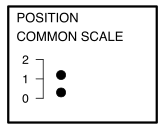

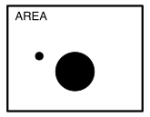

. . . 

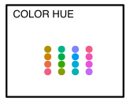


## Retrieving information from graphs

Cleveland and McGill (1984) tested how accurately people judge values from different encodings.

Position tended to be judged most accurately, colour and volume least accurately — but the exact ordering varies with the task, data size and design (see Heer and Bostock, 2010).

## More accurate encodings {.smaller}


Examples

  

Position on a common scale and length/direction support more accurate value judgments in these experiments. Bar and scatter plots build on this.

## Less accurate encodings {.smaller}

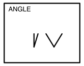

Angle, area, volume and colour are generally judged less accurately for extracting precise values. They remain useful for other purposes, such as using colour to group categories.

## Examples of less accurate encodings {.smaller}

Examples

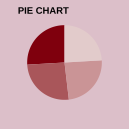   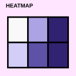

These encodings can reveal patterns, but they make precise comparisons harder than position or length on a common scale.

::: aside

Cleveland, William S., and Robert McGill. (1984) “Graphical Perception.” Heer, Jeffrey, and Michael Bostock. (2010) “Crowdsourcing Graphical Perception.”

:::

## Preattentive processing

. . . 

* Viewers can notice that certain features are present or absent without focusing attention on a particular area.

. . . 

* Which plot makes the data points easiest to distinguish?

<center>
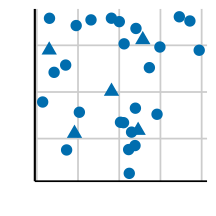
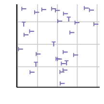
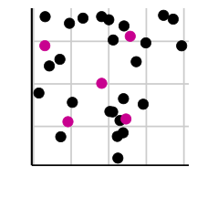
</center>


::: aside

Healey, Christopher G., and James T. Enns (2012) “Attention and Visual Memory in Visualization and Computer Graphics.” IEEE Transactions on Visualization and Computer Graphics 18 (7): 1170–88.

:::

# Gestalt principles

* "Gestalt" is German for form or shape.
* Gestalt principles describe how people perceive a collection of individual elements as a whole.

## Law of proximity

* Placing elements close together makes them easier to group and compare.

. . . 

```{r gestalt-proximity, fig.height = 2, fig.width = 8}
dfsex %>% 
  ggplot(aes(count, birth)) + 
  geom_col() + 
  facet_wrap(~sex, nrow = 1) +
  scale_x_continuous(labels = scales::comma) + 
  labs(y = "Place of birth", x = "Number of Australian residents",
       caption = "Data source: Australian Census 2021",
       title = "Five most common countries of birth outside Australia, by sex")
```

For which countries of birth are there more women than men among Australian residents?


## Law of proximity


```{r gestalt-proximity2, fig.height = 2, fig.width = 8}
gprox <- dfsex %>% 
  ggplot(aes(count, birth, fill = sex)) + 
  geom_col(position = "dodge") + 
  scale_x_continuous(labels = scales::comma) + 
  labs(y = "Place of birth", x = "Number of Australian residents",
       caption = "Data source: Australian Census 2021",
       title = "Five most common countries of birth outside Australia, by sex",
       fill = "Sex")
gprox
```

. . . 

**Data story**

Among Australian residents born in the Philippines or China, women outnumber men. Among residents born in India, men outnumber women.


## Law of similarity

* When objects share similar attributes, they are perceived as being part of the same group. 

. . . 

```{r gestalt-similarity, fig.height = 2, fig.width = 8}
span <- function(color, text) glue::glue("<b style='color:{color};'>{text}</b>")
dfsex %>% 
  mutate(birth = case_when(birth == "England" ~ span("#006DAE", "England"),
                           birth == "India" ~ span("#C8008F", "India"),
                           birth == "China" ~ span("#C8008F", "China"),
                           birth == "Philippines" ~ span("#C8008F", "Philippines"),
                           birth == "New Zealand" ~ span("#008A25", "New Zealand")),
         birth = fct_reorder(birth, count)) %>% 
  ggplot(aes(count, birth, fill = sex)) + 
  geom_col(position = "dodge") + 
  scale_x_continuous(labels = scales::comma) + 
  labs(y = "Place of birth", x = "Number of Australian residents",
       caption = "Data source: Australian Census 2021",
       title = "Five most common countries of birth outside Australia, by sex",
       fill = "Sex") +
  theme(axis.text.y = ggtext::element_markdown())
```

. . . 


Notice that the countries are coloured by continent (`r span("#006DAE", "Europe")`, `r span("#C8008F", "Asia")` and `r span("#008A25", "Oceania")`).

## Law of closure

* Objects collected within a boundary-like structure are perceived as a group.

. . . 

```{r gestalt-closure, fig.height = 2, fig.width = 8}
span <- function(color, text) glue::glue("<b style='color:{color};'>{text}</b>")
dfsex %>% 
  mutate(group = case_when(birth == "England" ~ "Europe",
                           birth == "India" ~ "Asia",
                           birth == "China" ~ "Asia",
                           birth == "Philippines" ~ "Asia",
                           birth == "New Zealand" ~ "Oceania")) %>% 
  ggplot(aes(count/1000, birth, fill = sex)) + 
  geom_col(position = "dodge") + 
  scale_x_continuous(labels = scales::comma) + 
  labs(y = "Place of birth", x = "Number of Australian residents (thousands)",
       caption = "Data source: Australian Census 2021",
       title = "Five most common countries of birth outside Australia, by sex",
       fill = "Sex") +
  facet_wrap(~group, scales = "free") +
  theme(axis.text.y = ggtext::element_markdown())
```


# Colour space

::: {.f3 .monash-gray80}

Zeileis, Fisher, Hornik, Ihaka, McWhite,
Murrell, Stauffer, Wilke (2019). colorspace: A
Toolbox for Manipulating and Assessing Colors and
Palettes. *arXiv 1903.06490*

Zeileis, Hornik, Murrell (2009). Escaping RGBland:
Selecting Colors for Statistical Graphics.
_Computational Statistics & Data Analysis_ 53(9)
3259-3270

:::

## Qualitative palettes

* Designed for categorical variables with no inherent ordering


```{r, fig.height = 4, fig.width = 8, echo = TRUE}
#| code-line-numbers: false
colorspace::hcl_palettes("Qualitative", plot = TRUE, n = 7)
```

## Sequential palettes

* Designed for ordered categories or numeric values that move from low to high, or vice versa


```{r, fig.height = 4, fig.width = 10, echo = TRUE}
#| code-line-numbers: false
colorspace::hcl_palettes("Sequential", plot = TRUE, n = 7)
```


## Diverging palettes {.smaller}

* Designed for ordered categories or numeric values that diverge from a meaningful neutral value


```{r, fig.height = 4.5, fig.width = 8, echo = TRUE}
#| code-line-numbers: false
colorspace::hcl_palettes("Diverging", plot = TRUE, n = 7)
```

## Colour-vision deficiency {.smaller}

Colour-vision deficiency affects roughly one in eight men.

```{r, fig.width = 12}
colorblindr::cvd_grid(gprox)
```

Check your colour choices with the [`colorblindr`](https://github.com/clauswilke/colorblindr) package or another colour-vision simulator.


# Putting it all together

## A practical design workflow

::: {.columns}

::: {.column width="33%"}

### 1. Diagnose

* What is the message?
* Who is the audience?
* What comparison must they make?

:::

::: {.column width="33%"}

### 2. Redesign

* Choose an encoding
* Create visual hierarchy
* Remove distractions

:::

::: {.column width="33%"}

### 3. Evaluate

* Check honesty
* Check accessibility
* Test whether the message is clear

:::

:::


## Diagnose the first draft {.smaller}

::: {.columns}

::: {.column width="62%"}

```{r workflow-draft, fig.width = 7, fig.height = 3.5}
ggplot(workflow_birthplace, aes(birth, percentage, fill = birth)) +
  geom_col() +
  theme(axis.text.x = element_text(angle = 45, hjust = 1)) +
  labs(
    x = NULL, y = "Percentage", fill = "Place of birth",
    title = "Birthplaces"
  )
```

:::

::: {.column width="38%"}

**What makes this difficult to use?**

. . .

* The purpose is unclear
* Labels are difficult to scan
* The legend repeats the axis
* Every country receives equal emphasis
* The population, year and source are missing

:::

:::


## Define the message and audience

::: {.callout-note}

### Audience

A general reader who has not seen the Census table.

:::

. . .

::: {.callout-important}

### Message

India became the third most common country of birth among Australian residents in 2021, overtaking China and New Zealand.

:::

. . .

The words **became** and **overtaking** mean that the visual must show change, not only the 2021 ranking.


## Match the comparison to the encoding {.smaller}

| Question | Evidence needed | Useful encoding |
|---|---|---|
| What ranked third in 2021? | Values from 2021 | Ordered bars |
| What changed between censuses? | Values from 2016 and 2021 | Lines or paired points |
| Did the share change? | A common denominator | Percentage of residents |

. . .

::: {.callout-tip}

The headline determines the comparison the chart must make possible.

:::


## Activity: redesign the first draft {.smaller}

::: {.columns}

::: {.column width="55%"}

```{r workflow-activity, fig.width = 7, fig.height = 3.3}
ggplot(workflow_birthplace, aes(birth, percentage, fill = birth)) +
  geom_col() +
  theme(axis.text.x = element_text(angle = 45, hjust = 1)) +
  labs(
    x = NULL, y = "Percentage", fill = "Place of birth",
    title = "Birthplaces"
  )
```

:::

::: {.column width="45%"}

Working with a partner:

1. Write the message as one sentence.
2. Identify the comparison the chart should support.
3. Sketch a redesign.
4. Justify two design choices using perception, Gestalt principles or accessibility.

**Time: four minutes**

:::

:::


## Create hierarchy and remove distractions {.smaller}

::: {.columns}

::: {.column width="68%"}

```{r workflow-redesign, fig.width = 8, fig.height = 3.8}
ggplot(workflow_birthplace, aes(percentage / 100, birth)) +
  geom_col(fill = "grey75", width = 0.7) +
  geom_col(
    data = ~filter(.x, birth == "India"),
    fill = "#006DAE", width = 0.7
  ) +
  geom_text(
    aes(label = scales::percent(percentage / 100, accuracy = 0.1)),
    hjust = -0.15, size = 4.5
  ) +
  scale_x_continuous(
    labels = scales::percent,
    expand = expansion(mult = c(0, 0.16))
  ) +
  coord_cartesian(clip = "off") +
  labs(
    x = "Percentage of Australian residents", y = NULL,
    title = "India ranked third among all countries of birth",
    subtitle = "Australia ranked first and is omitted from this chart",
    caption = "Source: Australian Census 2021"
  ) +
  theme_minimal(base_size = 16) +
  theme(
    panel.grid.major.y = element_blank(),
    panel.grid.minor = element_blank()
  )
```

:::

::: {.column width="32%"}

* Order supports comparison
* Horizontal labels are easy to scan
* Colour directs attention
* Direct labels remove legend lookup
* Title and source add context

:::

:::


## Evaluate before publishing

::: {.columns}

::: {.column width="50%"}

### Evidence

* Does the title match the data shown?
* Is the denominator clear?
* Could the axis exaggerate a difference?
* Are important groups or time points missing?

:::

::: {.column width="50%"}

### Communication

* Is the intended comparison easy?
* Is colour carrying meaning by itself?
* Are labels legible at presentation size?
* Can the source and time period be found?

:::

:::


## The five-second test

Show the visual to someone unfamiliar with the analysis for five seconds, then hide it.

. . .

Ask them:

1. What was the main message?
2. What comparison did the chart ask you to make?
3. What evidence do you remember?

. . .

If their answers differ from your intention, revise the visual—not the viewer.


## Week 6 lesson {.smaller}


::: callout-important

## Summary

* Start with the message, then choose a plot that makes the relevant comparison clear.
* Position and length support more accurate comparisons than angles, areas and colour intensity.
* Preattentive features and Gestalt principles help guide an audience's attention.
* Choose a palette suited to the data and check that it remains accessible to people with colour-vision deficiency.
* Diagnose, redesign and test a visual before publishing it.

:::

## Week 6 resources {.smaller}

::: callout-tip

### Resources

* [From Data to Viz](https://www.data-to-viz.com/)
* [The R Graph Gallery](https://r-graph-gallery.com/)
* [Fundamentals of Data Visualization by Claus O. Wilke](https://clauswilke.com/dataviz/)
* [Learn R Chapter 6 Data Visualisation](https://learnr.numbat.space/chapter6)
* [Utilizing Gestalt Principles to Improve Your Data Visualization Design](https://vizzendata.com/2020/07/06/utilizing-gestalt-principles-to-improve-your-data-visualization-design/)


:::
