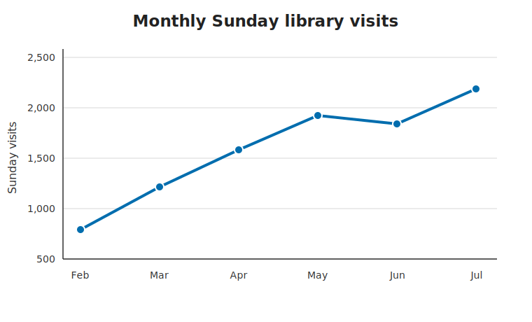

## 🎯 Objectives

By the end of this workshop, you will be able to:

* separate observation from interpretation;
* write a takeaway title, caption and in-text figure reference; and
* adapt a visual message for different audiences.

::: {.callout-note}
## Fictional data

The chart shows monthly visits to a fictional council's three libraries after Sunday opening began in February. It is supplied as a communication exercise, not as a real source.
:::

{#fig-library-visits fig-alt="A line chart in which Sunday library visits rise from 790 in February to 2100 in July, with a small decline between May and June."}

## 1. Quickwrite: observation or explanation? (5 minutes)

Write five statements about @fig-library-visits. Label each statement:

* **O** if it reports something visible in the chart;
* **I** if it interprets what the pattern might mean; or
* **C** if it makes a causal claim.

## 2. Decide the communication goal (5 minutes)

Assume the council is deciding whether to continue the trial. Write:

1. the one thing the chart makes easiest to see;
2. one important thing the chart cannot tell us; and
3. the question a decision-maker should ask next.

## 3. Replace the neutral title (8 minutes)

Write three possible titles:

1. a neutral descriptive title;
2. a takeaway title that states the main pattern; and
3. an irresponsible title that goes beyond the evidence.

Circle the words that make the third title irresponsible. Choose and refine the best responsible title, aiming for no more than 14 words.

## 4. Write the caption (10 minutes)

Write a self-contained caption containing:

* the overall takeaway;
* one or two numbers that support it;
* what is being counted and over what period;
* the entrance-counter source; and
* the important limitation that visits are not necessarily unique visitors.

## 5. Introduce the figure in prose (7 minutes)

Write two sentences suitable for a report. The first should explain why the reader is being shown the figure. The second should interpret the relevant pattern rather than saying only “the line goes up”. Include a cross-reference to @fig-library-visits.

## 6. Audience pivot (7 minutes)

Rewrite your takeaway title for one of these readers:

* a library operations manager concerned about staffing; or
* a community newsletter reader deciding whether the service is useful.

Exchange both titles with a partner. Can they identify the intended audience and explain which words gave it away?

## 7. Writer's note (3 minutes)

Complete: "The chart shows ______, but it does not establish ______."

::: {.unilur-solution}
## Instructor notes

A defensible title is **Sunday library visits more than doubled by July**. “Sunday opening attracts 1,300 new library users” is indefensible: the counters record visits, not unique people, and the chart alone does not establish what caused the increase.

Use the irresponsible-title step to make overclaiming visible and discuss how titles frame the reader's interpretation before they inspect the axes.
:::
