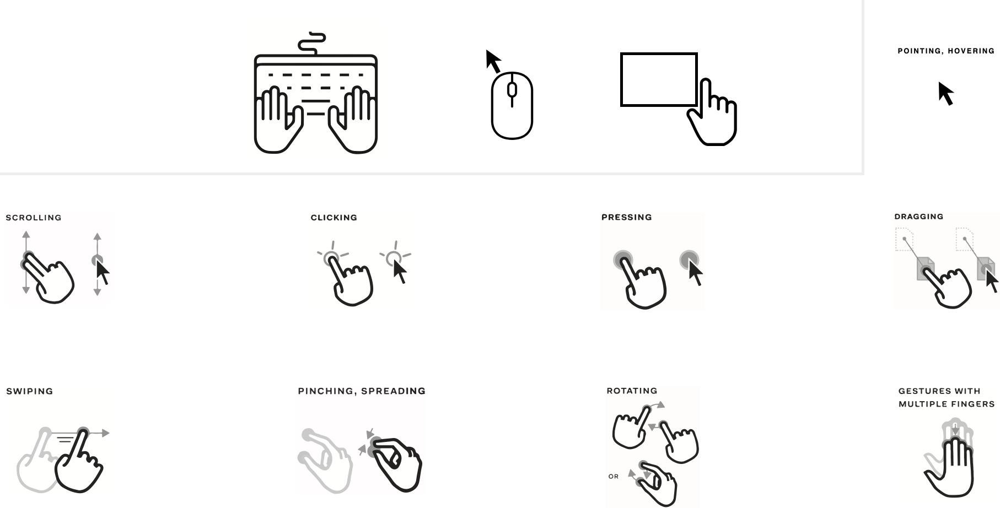
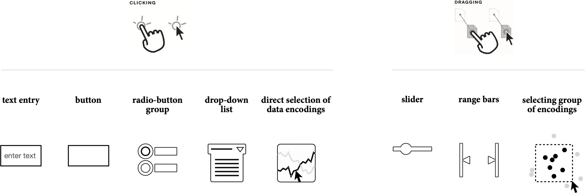
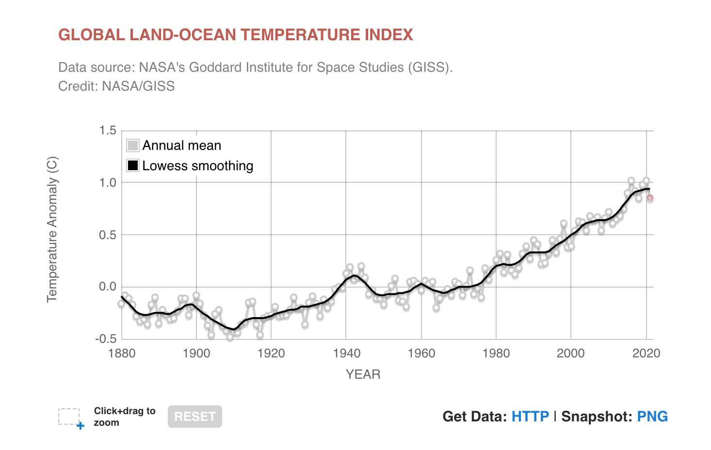
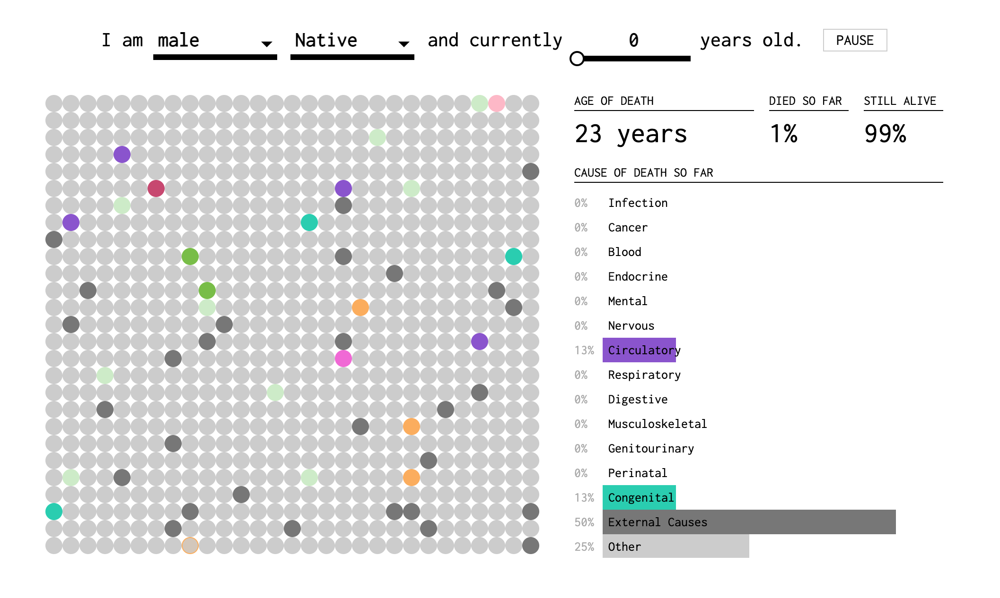
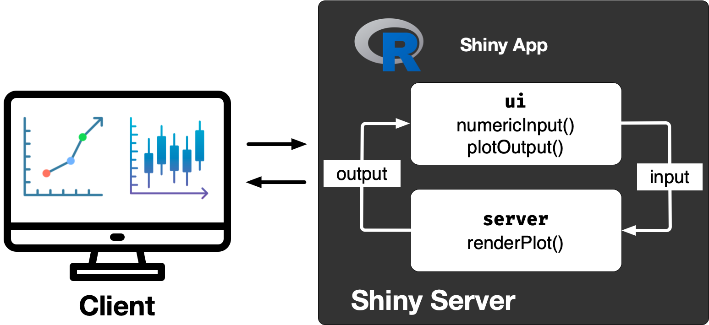

```{r, include = FALSE}
knitr::opts_chunk$set(
  fig.width = 7,
  fig.height = 4.2,
  fig.align = "center",
  out.width = "100%",
  fig.retina = 3,
  warning = FALSE,
  message = FALSE,
  cache = FALSE
)

library(dplyr)
library(ggplot2)

batters <- read.csv("data/wpl_batters.csv")

batting_plot <- function(data, season_value) {
  data |>
    filter(season == season_value) |>
    ggplot(aes(x = dot_percent, y = boundary_percent, size = balls_faced)) +
    geom_point(colour = "#006DAE", alpha = 0.65) +
    labs(
      title = paste("Batting patterns in", season_value),
      subtitle = "Top 20 run-scorers with at least 50 balls faced",
      x = "Dot-ball percentage",
      y = "Boundary percentage",
      size = "Balls faced"
    ) +
    scale_x_continuous(labels = scales::label_percent(scale = 1)) +
    scale_y_continuous(labels = scales::label_percent(scale = 1)) +
    theme_minimal(base_size = 15) +
    theme(
      plot.title.position = "plot",
      panel.grid.minor = element_blank(),
      legend.position = "right"
    )
}
```

## <br>[`r rmarkdown::metadata$pagetitle`]{.monash-blue} {#etc5523-title background-image="images/bg-01.png"}

### `r rmarkdown::metadata$subtitle`

Lecturer: *`r rmarkdown::metadata$author`*

`r rmarkdown::metadata$department`

::: tl
<br>

<ul class="fa-ul">
<li>[<i class="fas fa-envelope"></i>]{.fa-li}`r rmarkdown::metadata$email`</li>
<li>[<i class="fas fa-calendar-alt"></i>]{.fa-li} `r rmarkdown::metadata$date`</li>
<li>[<i class="fa-solid fa-globe"></i>]{.fa-li}<a href="https://`r rmarkdown::metadata[["unit-url"]]`">`r rmarkdown::metadata[["unit-url"]]`</a></li>
</ul>
:::

## By the end of today

::: {.callout-important}

You will be able to:

* decide when interaction improves data communication;
* explain how Shiny connects an input to an output; and
* build and critique a small interactive app around a user's goal.

:::

::: {.fragment .callout-tip}

Interactivity is useful when it helps someone answer a question—not merely because it is possible.

:::

## A static chart answers the author's question

```{r, echo=FALSE}
batting_plot(batters, "2024/25")
```

::: {.f4 .absolute .bottom-0}
Data: Cricsheet, accessed through the `cricketdata` package.
:::

## But whose question is it?

Someone viewing the chart might want to:

::: incremental
* examine another season;
* identify a particular batter;
* compare players with similar workloads; or
* understand what counts as an unusual batting pattern.
:::

::: {.fragment .callout-note}
Which of these questions should the display support?
:::

## Interaction creates a constrained conversation

::: columns
::: {.column width="31%"}
### User goal

What does the person want to understand or decide?
:::

::: {.column width="31%"}
### Action

What can they select, reveal, filter or compare?
:::

::: {.column width="31%"}
### Feedback

How does the display show what changed and what it means?
:::
:::

::: {.fragment .callout-tip}
The user can influence the path, but the designer still defines the useful paths.
:::

## Actions and inputs are not the same thing

::: columns
::: {.column width="50%"}
{fig-align="center"}
:::

::: {.column width="50%"}
{fig-align="center"}
:::
:::

::: {.fragment}
A widget is only useful when its action serves the user's goal.
:::

::: {.f4 .absolute .bottom-0}
Images adapted from Spencer (2022), *Data in Wonderland*.
:::

# Three tests for useful interaction

## Test the interaction before building it

::: columns
::: {.column width="31%"}
### Expressiveness

Can the user perform the actions needed to obtain the information?
:::

::: {.column width="31%"}
### Effectiveness

Can the user communicate their intention accurately and understand the response?
:::

::: {.column width="31%"}
### Efficiency

Is the insight gained worth the effort required from the user and developer?
:::
:::

::: {.f4 .absolute .bottom-0}
Adapted from Tominski and Schumann (2020), *Interactive Visual Data Analysis*.
:::

## NASA lets readers move between overview and detail

[Global temperature: NASA Earth Indicator](https://science.nasa.gov/earth/explore/earth-indicators/global-temperature/)

{fig-align="center"}

::: {.fragment .callout-note}
What question becomes easier to answer through interaction?
:::

## Handwriting makes model behaviour tangible {background-iframe="https://distill.pub/2016/handwriting/" background-interactive=true}

## Personalisation can make abstract risk concrete

[How You Will Die — FlowingData](https://flowingdata.com/2016/01/19/how-you-will-die/)

{fig-align="center"}

::: {.fragment .callout-note}
What does personalisation add—and what responsibilities come with it?
:::

## Interaction must earn its place

Use interaction when it supports:

* **exploration** — pursuing different questions;
* **description** — inspecting observations or subsets;
* **explanation** — revealing relationships or mechanisms;
* **confirmation** — checking a specific hypothesis; or
* **presentation** — adapting a message to a user's context.

::: {.fragment .callout-important}
If every useful path leads to the same conclusion, a well-designed static display may be better.
:::

# Shiny connects choices to displays

## What is Shiny?

Shiny is an R framework for building web applications without having to manage the browser–server communication yourself.

::: {.fragment}
[New Zealand Trade Intelligence Dashboard](https://shiny.posit.co/r/gallery/government-public-sector/nz-trade-dash/)
:::

::: {.fragment .callout-note}
As you explore it, identify the user goal, available actions and feedback.
:::

## Our first app has one job

> Let a cricket follower compare batting patterns within a chosen WPL season.

It needs only:

::: incremental
* one meaningful input: the season;
* one output: the batting-pattern chart; and
* enough explanation to interpret the chart.
:::

## Every Shiny app has a UI and a server

::: columns
::: {.column width="46%"}
### UI

Defines what the user can see and do.

```r
ui <- page_sidebar(...)
```
:::

::: {.column width="46%"}
### Server

Defines how outputs respond to inputs.

```r
server <- function(input, output, session) {
  ...
}
```
:::
:::

```r
shinyApp(ui, server)
```

## An `app.R` file has four parts

```r
library(shiny)                 # 1. Load packages and data
library(bslib)

ui <- page_fluid(             # 2. Define what the user sees
  ...
)

server <- function(input, output, session) { # 3. Define responses
  ...
}

shinyApp(ui, server)           # 4. Assemble and run the app
```

Save these four parts together in a file called `app.R`.

## Input functions create controls

Function | The user can
--- | ---
`selectInput()` | choose one item from a list
`sliderInput()` | choose a number or range
`checkboxInput()` | turn an option on or off
`dateRangeInput()` | choose a period
`actionButton()` | trigger an explicit action
`fileInput()` | upload a file

::: {.fragment .callout-tip}
Choose the control that matches the decision the user is making.
:::

## Every input has an ID and a current value

::: columns
::: {.column width="48%"}
### In the UI

```r
sliderInput(
  "top_n",
  "Number of batters",
  min = 5,
  max = 20,
  value = 10
)
```
:::

::: {.column width="44%"}
### In the server

```r
input$top_n
```

The value changes whenever the user moves the slider.
:::
:::

::: {.fragment .callout-important}
The string `"top_n"` in the UI becomes `input$top_n` in the server.
:::

## Step 1: give the user one meaningful choice

```r
selectInput(
  "season",
  "Choose a season",
  choices = sort(unique(batters$season))
)
```

::: {.fragment}
* `"season"` is the input ID.
* The label uses the reader's language.
* The available choices come from the data.
:::

## Step 2: reserve a place for the result

```r
plotOutput("batters_plot")
```

::: {.fragment}
`"batters_plot"` is the output ID. The UI does not draw the plot; it creates a place for it.
:::

## Outputs need a UI function and a renderer

Server | UI
--- | ---
`renderPlot()` | `plotOutput()`
`renderText()` | `textOutput()`
`renderTable()` | `tableOutput()`
`renderPrint()` | `verbatimTextOutput()`
`renderUI()` | `uiOutput()`
`DT::renderDT()` | `DT::DTOutput()`

Choose the pair that matches the kind of result you are producing.

## The output ID joins the UI to the server

::: columns
::: {.column width="45%"}
### In the UI

```r
plotOutput("batters_plot")
```
:::

::: {.column width="48%"}
### In the server

```r
output$batters_plot <-
  renderPlot({
    # code that returns a plot
  })
```
:::
:::

::: {.fragment .callout-important}
The string `"batters_plot"` in the UI becomes `output$batters_plot` in the server.
:::

## Step 3: connect the choice to the result

```r
output$batters_plot <- renderPlot({
  batters |>
    filter(season == input$season) |>
    ggplot(aes(dot_percent, boundary_percent)) +
    geom_point()
})
```

::: {.fragment}
Shiny records that `batters_plot` depends on `input$season`.
:::

## Put the UI together

```r
ui <- page_sidebar(
  title = "How do WPL batters score their runs?",
  sidebar = sidebar(
    selectInput("season", "Choose a season",
                choices = sort(unique(batters$season)))
  ),
  plotOutput("batters_plot")
)
```

The UI contains the visible controls and output locations.

## Put the server together—and run the app

```r
server <- function(input, output, session) {
  output$batters_plot <- renderPlot({
    batters |>
      filter(season == input$season) |>
      ggplot(aes(dot_percent, boundary_percent)) +
    geom_point()
  })
}

shinyApp(ui, server)
```

The server reads `input$season`, creates a plot and assigns it to `output$batters_plot`.

## Predict before running the app

When the user chooses a different season:

1. What value changes?
2. Which expression runs again?
3. Which part of the page is redrawn?

::: {.fragment .callout-important}
`input$season` changes → `renderPlot()` reruns → `batters_plot` is redrawn.
:::

## Reactivity is a dependency graph

::: columns
::: {.column width="29%"}
### Source

```r
input$season
```
:::

::: {.column width="34%"}
### Calculation

```r
filter(
  season == input$season
)
```
:::

::: {.column width="29%"}
### Endpoint

```r
output$batters_plot
```
:::
:::

::: {.fragment}
Shiny invalidates and recomputes only the downstream work that depends on a changed value.
:::

## A reactive expression shares a calculation

```r
selected_batters <- reactive({
  batters |>
    filter(season == input$season)
})

output$batters_plot <- renderPlot({
  ggplot(selected_batters(),
         aes(dot_percent, boundary_percent)) +
    geom_point()
})
```

::: {.fragment .callout-tip}
A reactive expression is called like a function: `selected_batters()`.
:::

## `req()` waits until an input is available

```r
output$batters_plot <- renderPlot({
  req(input$season)

  ggplot(selected_batters(),
         aes(dot_percent, boundary_percent)) +
    geom_point()
})
```

Use `req()` when an output cannot be calculated until the user has supplied a value.

# A working app is not yet a useful app

## Code can work while communication fails

```r
selectInput("x", "Select", choices = seasons)
plotOutput("plot")
```

::: {.fragment}
The code does not tell the user:

* why they should choose a season;
* how to interpret the chart;
* which observations are included; or
* where the data came from.
:::

## Purposeful language predicts what will happen

::: columns
::: {.column width="44%"}
### Ambiguous

* Select
* Value
* Submit
* Plot
:::

::: {.column width="48%"}
### Purposeful

* Choose a season
* Number of leading batters
* Show batting patterns
* Batting patterns in 2024/25
:::
:::

::: {.fragment .callout-tip}
Write labels in the user's language, not the implementation's language.
:::

## Explain the output where it is read

An effective output includes:

* a title that reflects the current selection;
* a short instruction for reading the display;
* the scope of the data;
* a source; and
* a limitation or warning where it becomes relevant.

::: {.fragment .callout-note}
“Upper-left” is meaningful guidance. “Interactive scatterplot” is merely a format label.
:::

## Defaults and constraints are part of the argument

For the cricket app:

* select a season by default so the first screen is informative;
* include batters with a meaningful number of balls faced;
* limit the display to leading run-scorers; and
* tell the user about both restrictions.

::: {.fragment}
Defaults influence what users see first; they should be deliberate and defensible.
:::

## Design for more than the ideal interaction

Check that the app:

::: incremental
* has visible, descriptive labels;
* does not rely on colour alone;
* works with keyboard navigation and different screen sizes;
* explains empty, invalid and loading states; and
* gives feedback after an action.
:::

## The improved app adds communication, not complexity

```r
card(
  card_header(textOutput("plot_title")),
  p("Batters towards the upper-left combine more boundaries",
    "with fewer dot balls."),
  plotOutput("batters_plot"),
  card_footer(
    "Top 20 run-scorers with at least 50 balls faced.",
    "Source: Cricsheet via cricketdata."
  )
)
```

::: {.fragment}
Run the complete version with `shiny::runApp("week9/cricket_app.R")` from the project root.
:::

## Which feature should come next?

The user wants to understand why two batters occupy similar positions. Which addition best supports that goal?

::: incremental
1. Hover details showing runs and balls faced
2. Another colour palette
3. A download button
:::

::: {.fragment .callout-important}
Choose features by the question they help answer—not by how impressive they look.
:::

## The browser and R exchange messages

{fig-align="center"}

::: {.fragment}
The UI sends input values to the server; the server sends updated output back. Shiny manages this exchange and tracks the reactive dependencies.
:::

# From a user question to a useful app

## Use this sequence for your own app

1. Name the user and their goal.
2. State the question the app helps answer.
3. Choose the smallest useful interaction.
4. Connect the input to an interpretable output.
5. Add labels, context, sources and limitations.
6. Test the conversation with another person.

## Exit ticket

Complete these sentences:

* This app is for …
* They arrive because they want to know …
* The smallest useful interaction is …
* The output helps because …
* A static display would be better if …

## Week 9 summary

::: {.callout-important}

* Interactivity should serve a user goal.
* Expressiveness, effectiveness and efficiency help us evaluate an interaction.
* Shiny connects inputs to outputs through reactive dependencies.
* A useful interface explains what to do, what changed and what the result means.

:::

## Resources

::: {.callout-tip}

* [Communicating with Interactive Articles](https://distill.pub/2020/communicating-with-interactive-articles/)
* [Shiny: Get started](https://shiny.posit.co/r/getstarted/shiny-basics/)
* [Mastering Shiny](https://mastering-shiny.org/)
* [`bslib` dashboards](https://rstudio.github.io/bslib/articles/dashboards/)
* [Shiny for R cheatsheet](https://rstudio.github.io/cheatsheets/shiny.pdf)

:::

# Appendix: Shiny reference

## Modern layouts with `bslib`

```r
page_sidebar(
  title = "App title",
  sidebar = sidebar(
    selectInput("season", "Choose a season", seasons)
  ),
  card(
    card_header("What the output shows"),
    plotOutput("plot")
  )
)
```

Use `layout_columns()` for responsive columns and `page_navbar()` when the content genuinely requires multiple views.

## Debugging, deployment and packaging

* Read the first error in the R console.
* Use `browser()` or an IDE breakpoint inside a reactive expression.
* Inspect the reactive graph with `reactlog` when dependencies are unclear.
* Deploy with `rsconnect::deployApp()` or publish from the IDE.
* Package an app only when reuse or distribution requires it; store app files under `inst/` and locate them with `system.file()`.

::: {.callout-note}
These are follow-on techniques. First make the user goal and the reactive path clear.
:::
